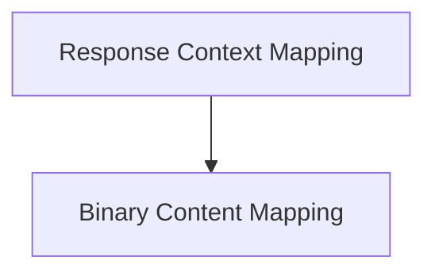

# Response Context and Binary Mapping Module

## Introduction and Purpose

The `response_context_and_binary_mapping` module is a critical component within the `pydantic_ai_models` module, specifically designed for integrating with OpenAI's chat completion API. Its primary purpose is to transform internal `ModelResponse` objects and various binary content items into the specific formats required by OpenAI's API, ensuring seamless communication and data exchange between the AI framework and the OpenAI models.

This module plays a vital role in preparing model outputs for OpenAI, handling both structured text responses (including thinking and tool calls) and diverse binary data such as images, audio, and documents. It ensures that the model's responses are correctly formatted, and that binary content is appropriately encoded and mapped to the corresponding OpenAI content parts.

## Architecture Overview

The `response_context_and_binary_mapping` module is composed of two main sub-modules:

1.  **Response Context Mapping**: Manages the intricate process of mapping different parts of a `ModelResponse` (like text, thinking parts, and tool calls) into a coherent `ChatCompletionAssistantMessageParam` for OpenAI.
2.  **Binary Content Mapping**: Focuses on converting various binary content types into OpenAI-compatible `ChatCompletionContentPartParam` objects, handling different media types and encoding requirements.

These sub-modules work in tandem to facilitate the complete transformation of internal model outputs into the format expected by the OpenAI API, thereby enabling robust and flexible integration.

## High-level Functionality of Each Sub-module

### [Response Context Mapping](response_context_mapping.md)

This sub-module, primarily driven by the `_MapModelResponseContext` component, is responsible for iterating through the parts of a `ModelResponse` and aggregating them into an OpenAI `ChatCompletionAssistantMessageParam`. It intelligently handles text content, incorporates "thinking" parts based on configured profiles, and maps internal tool call representations to OpenAI's `ChatCompletionMessageFunctionToolCallParam`.

### [Binary Content Mapping](binary_content_mapping.md)

The `binary_content_mapping` sub-module, centered around the `_map_binary_content_item` function, provides the logic for translating various `BinaryContent` items into their respective OpenAI `ChatCompletionContentPartParam` representations. It supports different media types, including images (converting them to image URLs with optional detail), audio (handling different encoding formats), and documents, ensuring proper formatting for inclusion in OpenAI API requests.

<!-- DIAGRAM_JSON
{
    "direction": "TD",
    "nodes": [
        {"id": "response_context_mapping", "label": "Response Context Mapping", "type": "module", "link": "response_context_mapping.md"},
        {"id": "binary_content_mapping", "label": "Binary Content Mapping", "type": "module", "link": "binary_content_mapping.md"}
    ],
    "edges": [
        {"source": "response_context_mapping", "target": "binary_content_mapping", "label": "uses"}
    ],
    "groups": []
}
-->

