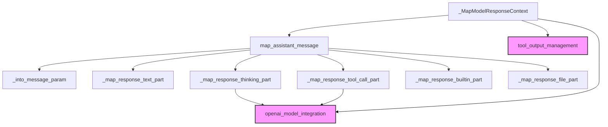

# response_context_mapping

This module is responsible for mapping internal AI model responses into a format compatible with OpenAI's chat completion assistant messages. It provides a flexible mechanism to process various types of model output parts (text, thinking, tool calls, etc.) and consolidate them into a structured OpenAI message. This is a critical component for integrating Pydantic AI's model response handling with the OpenAI API.

<!-- DIAGRAM_JSON
{
    "direction": "TD",
    "nodes": [
        {"id": "response_context_mapper", "label": "_MapModelResponseContext", "type": "component", "link": null},
        {"id": "map_assistant_msg", "label": "map_assistant_message", "type": "component", "link": null},
        {"id": "into_msg_param", "label": "_into_message_param", "type": "component", "link": null},
        {"id": "map_text_part", "label": "_map_response_text_part", "type": "component", "link": null},
        {"id": "map_thinking_part", "label": "_map_response_thinking_part", "type": "component", "link": null},
        {"id": "map_tool_call_part", "label": "_map_response_tool_call_part", "type": "component", "link": null},
        {"id": "map_builtin_part", "label": "_map_response_builtin_part", "type": "component", "link": null},
        {"id": "map_file_part", "label": "_map_response_file_part", "type": "component", "link": null},
        {"id": "openai_model_integration_module", "label": "openai_model_integration", "type": "external", "link": "openai_model_integration.md"},
        {"id": "tool_output_management_module", "label": "tool_output_management", "type": "external", "link": "tool_output_management.md"}
    ],
    "edges": [
        {"source": "response_context_mapper", "target": "map_assistant_msg"},
        {"source": "map_assistant_msg", "target": "into_msg_param"},
        {"source": "map_assistant_msg", "target": "map_text_part"},
        {"source": "map_assistant_msg", "target": "map_thinking_part"},
        {"source": "map_assistant_msg", "target": "map_tool_call_part"},
        {"source": "map_assistant_msg", "target": "map_builtin_part"},
        {"source": "map_assistant_msg", "target": "map_file_part"},
        {"source": "map_thinking_part", "target": "openai_model_integration_module"},
        {"source": "map_tool_call_part", "target": "openai_model_integration_module"},
        {"source": "response_context_mapper", "target": "openai_model_integration_module"},
        {"source": "response_context_mapper", "target": "tool_output_management_module"}
    ],
    "groups": []
}
-->

## Architecture and Core Components

The `response_context_mapping` module is centered around the `_MapModelResponseContext` class, which acts as a translator between the generic `ModelResponse` format used internally by Pydantic AI and the specific `ChatCompletionAssistantMessageParam` expected by the OpenAI API. This class is designed to be extensible, allowing for custom handling of various response parts through subclassing.

### _MapModelResponseContext Class

The `_MapModelResponseContext` class orchestrates the mapping process. It collects different parts of a `ModelResponse` and consolidates them into a single OpenAI assistant message.

#### Fields

*   `_model`: An instance of `OpenAIChatModel` from the [openai_model_integration](openai_model_integration.md) module, providing access to model-specific configurations and utility methods (e.g., for mapping tool calls).
*   `texts`: A list of strings to store text content from `TextPart` items.
*   `thinkings`: A dictionary mapping field names to lists of strings, used to store "thinking" content, especially when custom fields are enabled.
*   `tool_calls`: A list of `ChatCompletionMessageFunctionToolCallParam` objects, collecting tool calls identified in the model response.

#### Methods

*   `map_assistant_message(self, message: ModelResponse) -> chat.ChatCompletionAssistantMessageParam`:
    This is the main entry point for the mapping process. It iterates through each `item` in the provided `ModelResponse` (which is defined in [tool_output_management](tool_output_management.md)) and dispatches it to the appropriate internal mapping method based on its type (e.g., `TextPart`, `ThinkingPart`, `ToolCallPart`). Finally, it calls `_into_message_param` to construct and return the complete OpenAI assistant message.

*   `_into_message_param(self) -> chat.ChatCompletionAssistantMessageParam`:
    This method converts the collected `texts`, `thinkings`, and `tool_calls` into a single `ChatCompletionAssistantMessageParam`. It's designed as a hook for subclasses to implement custom logic for how these parts are combined into the final message. Thinking parts can be added as custom fields or embedded within the content using tags, based on the model profile configuration.

*   `_map_response_text_part(self, item: TextPart) -> None`:
    Handles `TextPart` items by appending their content to the `texts` list. Subclasses can override this for custom text processing.

*   `_map_response_thinking_part(self, item: ThinkingPart) -> None`:
    Processes `ThinkingPart` items. It uses the `OpenAIModelProfile` from the associated `_model` to determine how thinking parts should be included in the final message. Depending on the `openai_chat_send_back_thinking_parts` setting (`auto`, `tags`, or `field`), thinking content might be added to a custom field in `thinkings` or wrapped in `thinking_tags` and appended to `texts`. This method relies on configuration within the [openai_model_integration](openai_model_integration.md) module.

*   `_map_response_tool_call_part(self, item: ToolCallPart) -> None`:
    Maps `ToolCallPart` items to OpenAI's `ChatCompletionMessageFunctionToolCallParam` format by calling `_model._map_tool_call`. The resulting tool call is then added to the `tool_calls` list.

*   `_map_response_builtin_part(self, item: BuiltinToolCallPart | BuiltinToolReturnPart) -> None`:
    A placeholder method for handling built-in tool call or return parts. Currently, OpenAI models do not directly return built-in tool calls, so this method does nothing. Subclasses could override this if necessary.

*   `_map_response_file_part(self, item: FilePart) -> None`:
    A placeholder method for handling `FilePart` items. Similar to built-in tool parts, files generated by models are generally not sent back to models that don't generate files themselves. Subclasses can extend this behavior.

## Relationship to the Overall System

The `response_context_mapping` module plays a crucial role in the `pydantic_ai_models` ecosystem, specifically within the [openai_model_integration](openai_model_integration.md) sub-module. It acts as an adapter, ensuring that the internal, rich representation of a model's response (`ModelResponse` from [tool_output_management](tool_output_management.md)) can be correctly translated into the format required for interaction with the OpenAI API. This modular design allows for flexibility in handling different model providers and their specific API requirements, while maintaining a consistent internal representation of model outputs.
