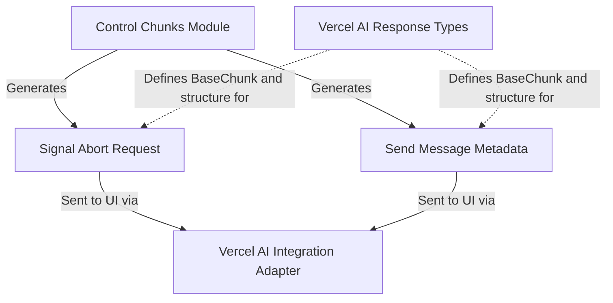

# `response_control_chunks` Module Documentation

The `response_control_chunks` module is a vital part of the `vercel_ai_adapter` within the `pydantic_ai_agent_core`, specifically designed to manage and define special control signals sent during a Vercel AI response stream. These chunks enable the UI to handle actions like abortion of a request or the transmission of supplementary metadata related to a message.

### Core Functionality

This module defines two key control chunk types:

1.  **`AbortChunk`**: This chunk signals that an ongoing operation or request should be aborted. It's crucial for providing a mechanism to gracefully terminate processes from the UI or based on internal logic. It includes an optional `reason` field for more descriptive abort messages.
2.  **`MessageMetadataChunk`**: This chunk allows for the inclusion of arbitrary metadata alongside a message in the response stream. This metadata can convey additional context, status, or any other relevant information to the UI without being part of the primary message content itself.

Together, these chunks enhance the interactivity and informational richness of Vercel AI responses, providing fine-grained control and data transmission capabilities.

### Architecture

The `response_control_chunks` module fits into the broader Vercel AI integration by providing concrete implementations of control-oriented response types. It relies on the definitions provided by the `vercel_ai_response_types` module for its base structure (`BaseChunk`) and is utilized by the `ui_vercel_ai_adapter` to format and send these chunks as part of the overall streamed response to the client. The `control_chunks` module acts as the direct orchestrator, generating these specific control chunks based on system events or user interactions.

<!-- DIAGRAM_JSON
{
    "direction": "TD",
    "nodes": [
        {"id": "abort_chunk", "label": "Signal Abort Request", "type": "component", "link": null},
        {"id": "message_metadata_chunk", "label": "Send Message Metadata", "type": "component", "link": null},
        {"id": "control_chunks_mod", "label": "Control Chunks Module", "type": "external", "link": "control_chunks.md"},
        {"id": "vercel_ai_response_types_mod", "label": "Vercel AI Response Types", "type": "external", "link": "vercel_ai_response_types.md"},
        {"id": "ui_vercel_ai_adapter_mod", "label": "Vercel AI Integration Adapter", "type": "external", "link": "ui_vercel_ai_adapter.md"}
    ],
    "edges": [
        {"source": "control_chunks_mod", "target": "abort_chunk", "label": "Generates"},
        {"source": "control_chunks_mod", "target": "message_metadata_chunk", "label": "Generates"},
        {"source": "abort_chunk", "target": "ui_vercel_ai_adapter_mod", "label": "Sent to UI via"},
        {"source": "message_metadata_chunk", "target": "ui_vercel_ai_adapter_mod", "label": "Sent to UI via"},
        {"source": "vercel_ai_response_types_mod", "target": "abort_chunk", "label": "Defines BaseChunk and structure for", "type": "dotted"},
        {"source": "vercel_ai_response_types_mod", "target": "message_metadata_chunk", "label": "Defines BaseChunk and structure for", "type": "dotted"}
    ],
    "groups": []
}
-->
