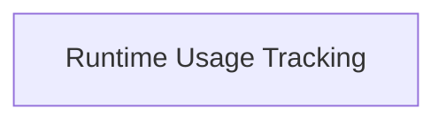

<!-- AUTO_GENERATED_PLACEHOLDER
  reason: LLM did not create .md file for this module
  module_path: pydantic_ai_agent_core/agent_utilities/runtime_usage
  component_count: 1
  generated_at: 2026-04-06T06:47:34.929848
  TODO: Fix LLM prompt to handle small leaf modules
-->

# Runtime Usage Tracking

> ⚠️ **Auto-Generated Placeholder**
> This documentation was auto-generated because the LLM failed to create it.
> Module path: `pydantic_ai_agent_core/agent_utilities/runtime_usage`

Provides a deprecated alias for `RunUsage`, indicating where runtime resource tracking is handled.

## Components

This module contains 1 component(s):

- `pydantic_ai_slim.pydantic_ai.usage.Usage`

## Structure

---
*Auto-generated placeholder. See sync_issues.json for details.*
