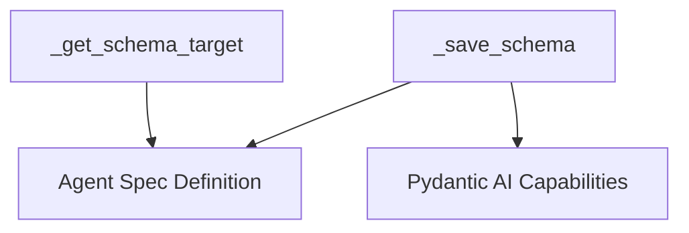

# schema_operations Module Documentation

## Introduction

The `schema_operations` module, part of the `pydantic_ai_agent_core` system, provides core utilities for managing and interacting with JSON schemas related to agent specifications. Specifically, it enables the saving of agent specification schemas to files and the intelligent retrieval of schema targets for introspection.

## Architecture and Component Relationships

This module encapsulates functions that are critical for defining and persisting the structure of AI agents. It interacts closely with agent specification definitions and capability definitions to ensure accurate schema generation and reflection.

<!-- DIAGRAM_JSON
{
    "direction": "TD",
    "nodes": [
        {"id": "save_schema", "label": "_save_schema", "type": "component", "link": null},
        {"id": "get_schema_target", "label": "_get_schema_target", "type": "component", "link": null},
        {"id": "agent_spec_definition", "label": "Agent Spec Definition", "type": "external", "link": "agent_spec_definition.md"},
        {"id": "pydantic_ai_capabilities", "label": "Pydantic AI Capabilities", "type": "external", "link": "pydantic_ai_capabilities.md"}
    ],
    "edges": [
        {"source": "save_schema", "target": "agent_spec_definition"},
        {"source": "save_schema", "target": "pydantic_ai_capabilities"},
        {"source": "get_schema_target", "target": "agent_spec_definition"}
    ],
    "groups": []
}
-->



### Core Components

#### `_save_schema`

`_save_schema` is responsible for generating and saving the JSON schema of an agent specification to a specified file path. It takes into account any custom capability types provided, ensuring that the schema accurately reflects the agent's complete structure and available capabilities. This function prevents unnecessary file writes by checking if the existing content matches the new schema.

```python
    def _save_schema(
        cls,
        path: Path | str,
        custom_capability_types: Sequence[type[AbstractCapability[Any]]] = (),
    ) -> None:
        """Save the JSON schema for this agent spec type to a file.

        Args:
            path: Path to save the schema to.
            custom_capability_types: Custom capability classes to include in the schema.
        """
        path = Path(path)
        json_schema = cls.model_json_schema_with_capabilities(custom_capability_types)
        schema_content = to_json(json_schema, indent=2).decode() + '
'
        if not path.exists() or path.read_text(encoding='utf-8') != schema_content:
            path.write_text(schema_content, encoding='utf-8')
```

#### `_get_schema_target`

`_get_schema_target` is a utility function that determines the appropriate target for schema generation, primarily focusing on the `__init__` method of a class or falling back to `from_spec` if `__init__` introspection fails. This ensures that the schema accurately represents the constructor parameters, which are crucial for agent instantiation.

```python
    def _get_schema_target(cls: type[Any]) -> Any:
        # When from_spec is not overridden, it delegates to cls(*args, **kwargs).
        # Use __init__ directly so build_schema_types sees the actual parameter types.
        # Fall back to from_spec if __init__ hints can't be resolved (e.g. TYPE_CHECKING imports).
        if 'from_spec' not in cls.__dict__:
            try:
                get_function_type_hints(cls.__init__)
                return cls.__init__
            except (NameError, TypeError, AttributeError):
                pass
        return cls.from_spec
```

## Integration with the Overall System

The `schema_operations` module is a fundamental part of the [pydantic_ai_agent_core.md](pydantic_ai_agent_core.md) module, specifically within its schema management utilities. It provides the essential mechanisms for defining, persisting, and retrieving the structural contracts for AI agents, which are then used throughout the `pydantic_ai_agent_core` system for agent instantiation, validation, and interaction. It relies on definitions from [agent_spec_definition.md](agent_spec_definition.md) and [pydantic_ai_capabilities.md](pydantic_ai_capabilities.md) to perform its schema operations correctly.