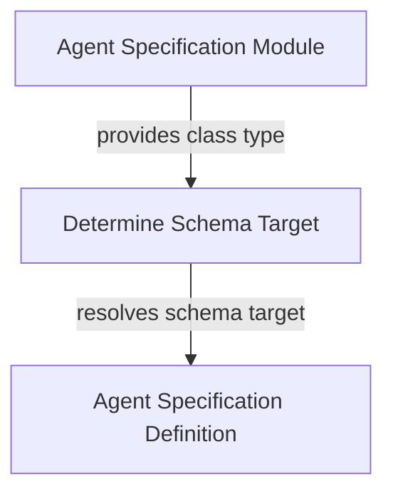

# schema_target_utilities

The `schema_target_utilities` module provides essential functionality for dynamically determining the correct Pydantic schema target within the agent specification process. This module is a critical helper, ensuring that agent definitions accurately reflect the structure and expected inputs/outputs of an agent's capabilities. It simplifies the complex task of schema generation by intelligently selecting the most appropriate method (`__init__` or `from_spec`) for Pydantic model creation.

## Module Overview

At its core, `schema_target_utilities` is designed to support the [agent_specification](agent_specification.md) module by resolving which function or method should be used as the source for generating an agent's Pydantic schema. This is particularly important for agents that can be defined either through their constructor (`__init__`) or a factory method (`from_spec`). The module's primary component ensures that the schema generation process is robust and adaptable to different agent implementation patterns.

### _get_schema_target

The `_get_schema_target` function is the central piece of this module. It takes a class type as input and, based on specific criteria, determines whether the class's `__init__` method or its `from_spec` method should be used as the Pydantic schema generation target.

**Workflow:**
1.  It first checks if the `from_spec` method has been explicitly overridden in the class's dictionary. If it hasn't, it attempts to use the `__init__` method.
2.  When attempting to use `__init__`, it tries to resolve its type hints. If successful, `__init__` is returned as the schema target, allowing Pydantic to build the schema based on the constructor's parameters.
3.  If resolving `__init__`'s type hints fails (e.g., due to `NameError`, `TypeError`, or `AttributeError` often caused by `TYPE_CHECKING` imports or unresolvable forward references), it falls back to using the `from_spec` method.
4.  If `from_spec` was explicitly overridden, it is always chosen as the schema target.

This intelligent selection process ensures flexibility in how agents are defined while maintaining accuracy in their Pydantic schema representation.

## Architecture

<!-- DIAGRAM_JSON
{
    "direction": "TD",
    "nodes": [
        {
            "id": "_get_schema_target",
            "label": "Determine Schema Target",
            "type": "component",
            "link": null
        },
        {
            "id": "agent_specification",
            "label": "Agent Specification Module",
            "type": "external",
            "link": "agent_specification.md"
        },
        {
            "id": "agent_spec_definition",
            "label": "Agent Specification Definition",
            "type": "external",
            "link": "agent_spec_definition.md"
        }
    ],
    "edges": [
        {
            "source": "agent_specification",
            "target": "_get_schema_target",
            "label": "provides class type"
        },
        {
            "source": "_get_schema_target",
            "target": "agent_spec_definition",
            "label": "resolves schema target"
        }
    ],
    "groups": []
}
-->
