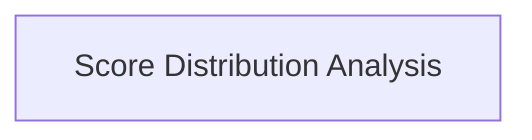

<!-- AUTO_GENERATED_PLACEHOLDER
  reason: LLM did not create .md file for this module
  module_path: pydantic_evals_framework/metric_evaluators/statistical_report_evaluators/score_distribution_evaluators/score_distribution_analysis
  component_count: 3
  generated_at: 2026-04-06T06:47:34.947816
  TODO: Fix LLM prompt to handle small leaf modules
-->

# Score Distribution Analysis

> ⚠️ **Auto-Generated Placeholder**
> This documentation was auto-generated because the LLM failed to create it.
> Module path: `pydantic_evals_framework/metric_evaluators/statistical_report_evaluators/score_distribution_evaluators/score_distribution_analysis`

Provides evaluators for analyzing the distribution of scores, including ROC AUC, Precision-Recall, and Kolmogorov-Smirnov statistics, to assess model performance.

## Components

This module contains 3 component(s):

- `pydantic_evals.pydantic_evals.evaluators.report_common.ROCAUCEvaluator`
- `pydantic_evals.pydantic_evals.evaluators.report_common.PrecisionRecallEvaluator`
- `pydantic_evals.pydantic_evals.evaluators.report_common.KolmogorovSmirnovEvaluator`

## Structure

---
*Auto-generated placeholder. See sync_issues.json for details.*
