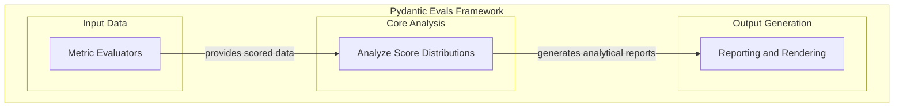

# Score Distribution Evaluators

## Introduction
The `score_distribution_evaluators` module is a critical component within the `pydantic_evals_framework`, specifically designed for analyzing and reporting on the distribution of scores generated by evaluation models. This module provides specialized evaluators that help assess model performance by examining metrics like ROC AUC, Precision-Recall, and Kolmogorov-Smirnov statistics, offering deep insights into how models score positive and negative cases. It is essential for understanding the robustness and discriminative power of evaluated systems.

## Architecture Overview
This module primarily consists of evaluators that consume processed case data, often including scores and labels, to produce detailed analytical reports. It acts as an analytical layer, taking input from higher-level evaluation orchestrators and feeding its results into reporting and rendering components.

<!-- DIAGRAM_JSON
{
    "direction": "TD",
    "nodes": [
        {
            "id": "score_distribution_evaluators",
            "label": "Score Distribution Evaluators",
            "type": "module"
        },
        {
            "id": "score_distribution_analysis",
            "label": "Analyze Score Distributions",
            "type": "module",
            "link": "score_distribution_analysis.md"
        },
        {
            "id": "metric_evaluators",
            "label": "Metric Evaluators",
            "type": "external",
            "link": "metric_evaluators.md"
        },
        {
            "id": "reporting_and_rendering",
            "label": "Reporting and Rendering",
            "type": "external",
            "link": "reporting_and_rendering.md"
        }
    ],
    "edges": [
        {
            "source": "metric_evaluators",
            "target": "score_distribution_analysis",
            "label": "provides scored data"
        },
        {
            "source": "score_distribution_analysis",
            "target": "reporting_and_rendering",
            "label": "generates analytical reports"
        }
    ],
    "groups": [
        {
            "id": "input_data",
            "label": "Input Data",
            "role": "data",
            "nodes": [
                "metric_evaluators"
            ]
        },
        {
            "id": "core_analysis",
            "label": "Core Analysis",
            "role": "analytical",
            "nodes": [
                "score_distribution_analysis"
            ]
        },
        {
            "id": "output_generation",
            "label": "Output Generation",
            "role": "surface",
            "nodes": [
                "reporting_and_rendering"
            ]
        }
    ]
}
-->

## Sub-modules
The `score_distribution_evaluators` module contains the following key sub-module:

### [Score Distribution Analysis](score_distribution_analysis.md)
This sub-module encapsulates the core logic for various score distribution evaluators, including ROC AUC, Precision-Recall, and Kolmogorov-Smirnov. It is responsible for processing evaluation case data and computing statistical metrics and visualizable curves to assess model performance rigorously.

