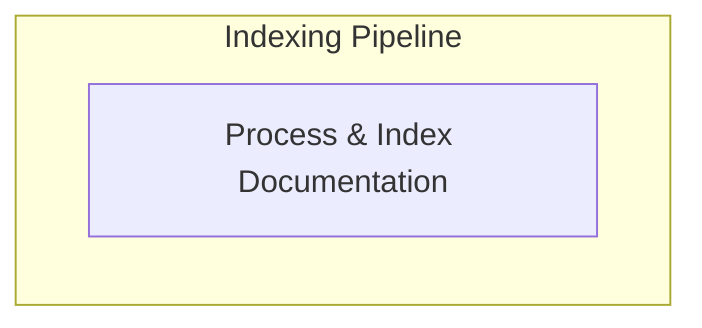

# Search and Indexing Module

The `search_and_indexing` module is responsible for preparing and indexing the project's documentation content for efficient search functionality, primarily leveraging Algolia. It ensures that the documentation is structured and optimized for search engines, making it easy for users and developers to find relevant information quickly.

## Architecture Overview

This module focuses on transforming raw HTML content from documentation pages into structured search records and then persisting these records for consumption by search platforms like Algolia.

<!-- DIAGRAM_JSON
{
    "direction": "TD",
    "nodes": [
        {
            "id": "search_and_indexing",
            "label": "Search and Indexing",
            "type": "module"
        },
        {
            "id": "algolia_indexing",
            "label": "Process & Index Documentation",
            "type": "module",
            "link": "algolia_indexing.md"
        }
    ],
    "edges": [],
    "groups": [
        {
            "id": "indexing_pipeline",
            "label": "Indexing Pipeline",
            "role": "data",
            "nodes": [
                "algolia_indexing"
            ]
        }
    ]
}
-->

## Sub-modules

### Algolia Indexing
This sub-module handles the parsing, cleaning, and structuring of HTML content from documentation pages into search-optimized records. It also manages writing these records to a file for deployment to Algolia.
Refer to [Algolia Indexing](algolia_indexing.md) for more details.
