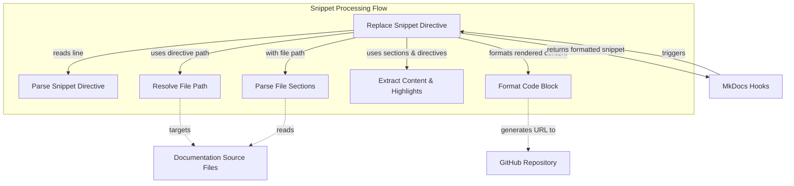

# Snippet Processing Module

The `snippet_processing` module is a vital component of the documentation generation system, specifically designed to embed live code snippets directly into Markdown documentation files. It ensures that code examples in the documentation are always synchronized with the source code, preventing outdated or incorrect examples.

## What this module does and why it matters

This module provides the core logic for processing special "snippet directives" found within Markdown files. These directives instruct the documentation generator to pull specific sections or lines of code from source files (e.g., Python, YAML, etc.), format them with syntax highlighting, and embed them as fenced code blocks. This approach significantly reduces maintenance overhead for documentation, as changes in the source code are automatically reflected in the documentation upon regeneration. It also enhances accuracy and trustworthiness of the documentation.

From a user's perspective (a documentation author), this module enables writing concise directives like:

```markdown
```python-snippet ../path/to/my_module.py fragment=my_function_example highlight="1,5-7" title="Example Function"
```

The `snippet_processing` module then expands this into a full, formatted code block, complete with a title that can link directly to the relevant lines on GitHub, and proper line highlighting.

## How its parts work together from a user's perspective

The primary component, `replace_snippet`, acts as the orchestrator. When an MkDocs hook (from `mkdocs_main_hooks`) identifies a snippet directive in a Markdown file during documentation build, it invokes `replace_snippet`. This function then:

1.  **Parses the directive**: It extracts information such as the file path, desired code fragment, lines to highlight, and custom title.
2.  **Resolves the file path**: It determines the absolute path to the source code file, handling both relative and absolute paths specified in the directive.
3.  **Reads and parses the source file**: It reads the specified source file and, if fragments are requested, parses it to identify named sections.
4.  **Extracts content**: It extracts the exact lines of code or specific fragments requested by the directive.
5.  **Formats the output**: Finally, it constructs a Markdown fenced code block, applying syntax highlighting based on the file extension, adding a title (potentially linked to the GitHub repository for easy navigation), and applying line highlighting as specified.

This seamless process means documentation authors only need to maintain the directives, and the system handles the dynamic inclusion and formatting of code.

## How it connects to the rest of the system

The `snippet_processing` module is integrated into the documentation build pipeline through MkDocs hooks, specifically managed by the `mkdocs_main_hooks` module within the `mkdocs_hooks_and_snippets` package. It receives raw Markdown lines containing snippet directives from these hooks and returns fully rendered Markdown code blocks.

It also implicitly depends on:
*   **Source Code Files**: The actual `.py`, `.yaml`, etc., files from which snippets are extracted. These are located throughout the repository, including potentially in example directories.
*   **Git/GitHub Integration**: For generating direct links to specific lines of code on GitHub, enhancing discoverability and context for developers.
*   **Pydantic AI Framework Root**: Constants like `REPO_ROOT` and `PYDANTIC_AI_EXAMPLES_ROOT` are used to correctly resolve file paths, linking it to the overall project structure.

<!-- DIAGRAM_JSON
{
    "direction": "TD",
    "nodes": [
        {
            "id": "mkdocs_hooks",
            "label": "MkDocs Hooks",
            "type": "external",
            "link": "mkdocs_main_hooks.md"
        },
        {
            "id": "replace_snippet_func",
            "label": "Replace Snippet Directive",
            "type": "component",
            "link": null
        },
        {
            "id": "parse_directive",
            "label": "Parse Snippet Directive",
            "type": "component",
            "link": null
        },
        {
            "id": "resolve_path",
            "label": "Resolve File Path",
            "type": "component",
            "link": null
        },
        {
            "id": "parse_sections",
            "label": "Parse File Sections",
            "type": "component",
            "link": null
        },
        {
            "id": "extract_content",
            "label": "Extract Content & Highlights",
            "type": "component",
            "link": null
        },
        {
            "id": "format_block",
            "label": "Format Code Block",
            "type": "component",
            "link": null
        },
        {
            "id": "source_files",
            "label": "Documentation Source Files",
            "type": "external",
            "link": null
        },
        {
            "id": "github",
            "label": "GitHub Repository",
            "type": "external",
            "link": null
        }
    ],
    "edges": [
        {
            "source": "mkdocs_hooks",
            "target": "replace_snippet_func",
            "label": "triggers"
        },
        {
            "source": "replace_snippet_func",
            "target": "parse_directive",
            "label": "reads line"
        },
        {
            "source": "replace_snippet_func",
            "target": "resolve_path",
            "label": "uses directive path"
        },
        {
            "source": "resolve_path",
            "target": "source_files",
            "label": "targets"
        },
        {
            "source": "replace_snippet_func",
            "target": "parse_sections",
            "label": "with file path"
        },
        {
            "source": "parse_sections",
            "target": "source_files",
            "label": "reads"
        },
        {
            "source": "replace_snippet_func",
            "target": "extract_content",
            "label": "uses sections & directives"
        },
        {
            "source": "replace_snippet_func",
            "target": "format_block",
            "label": "formats rendered content"
        },
        {
            "source": "format_block",
            "target": "github",
            "label": "generates URL to"
        },
        {
            "source": "replace_snippet_func",
            "target": "mkdocs_hooks",
            "label": "returns formatted snippet"
        }
    ],
    "groups": [
        {
            "id": "snippet_processing_flow",
            "label": "Snippet Processing Flow",
            "role": "data_transformation",
            "nodes": [
                "replace_snippet_func",
                "parse_directive",
                "resolve_path",
                "parse_sections",
                "extract_content",
                "format_block"
            ]
        }
    ]
}
-->

