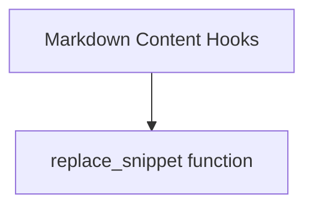

# Snippet Replacement Module

The `snippet_replacement` module, specifically through its `replace_snippet` function, is a vital component of the documentation build process. It enables dynamic embedding of code snippets from the project repository directly into markdown documentation files. This ensures that code examples are always accurate and synchronized with the latest codebase, enhancing the maintainability and reliability of the documentation.

## Core Functionality

The `replace_snippet` function is responsible for:
-   **Parsing Snippet Directives**: It identifies and parses custom directives within markdown files that specify a code snippet to be embedded. These directives include information such as the file path, specific fragments or lines to extract, highlighting instructions, and an optional title.
-   **File Resolution and Content Extraction**: It resolves the file path for the requested code snippet, supporting both absolute paths (relative to the repository root) and relative paths (relative to the current markdown file). It then reads and extracts the specified content, applying any fragment or highlight rules.
-   **Dynamic Title Generation**: It generates a descriptive title for the code block. If not explicitly provided, it constructs a title based on the file path and, if applicable, a link to the corresponding lines on GitHub, promoting easy navigation to the source code.
-   **Code Block Formatting**: It formats the extracted code into a standard markdown code block, applying syntax highlighting based on the file extension. It also incorporates custom attributes, such as line highlighting and any additional attributes specified in the snippet directive.

## Architecture and Component Relationships

The `snippet_replacement` module primarily revolves around the `replace_snippet` function. This function acts as a handler for a regular expression match, indicating its role in a larger markdown processing pipeline.

<!-- DIAGRAM_JSON
{
    "direction": "TD",
    "nodes": [
        {"id": "replace_snippet_func", "label": "replace_snippet function", "type": "component", "link": null},
        {"id": "markdown_content_hooks", "label": "Markdown Content Hooks", "type": "external", "link": "markdown_content_hooks.md"}
    ],
    "edges": [
        {"source": "markdown_content_hooks", "target": "replace_snippet_func"}
    ],
    "groups": []
}
-->

-   **`replace_snippet` function**: This is the core component of this module. It takes a regular expression match object containing the snippet directive and returns the fully formatted code block string.
-   **[Markdown Content Hooks](markdown_content_hooks.md)**: The `markdown_content_hooks` module, specifically its `on_page_markdown` hook, is responsible for invoking `replace_snippet`. It iterates through the markdown content, identifies snippet directives, and uses `replace_snippet` to transform them into rendered code blocks.

## Integration with the Overall System

The `snippet_replacement` module is an integral part of the `docs_hooks` system, nested within `markdown_content_hooks`. It contributes significantly to the automation and accuracy of the documentation generation process by:

-   **Maintaining Code-Doc Synchronization**: By directly pulling code from the repository, it eliminates the risk of outdated or incorrect code examples in the documentation.
-   **Streamlining Documentation Workflow**: Developers can easily embed code snippets using a simple directive, reducing the manual effort involved in copying and formatting code.
-   **Enhancing User Experience**: The generated code blocks come with features like syntax highlighting, line numbering, and direct links to the source on GitHub, improving the readability and navigability of the documentation for users.

This module works in conjunction with other documentation hooks to preprocess and enrich markdown content before it is rendered into the final documentation website.
