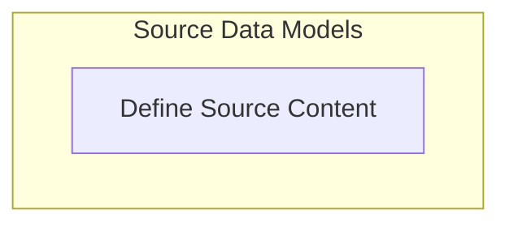

# Source Chunks Module Documentation

## Introduction and Purpose

The `source_chunks` module is a crucial part of the `pydantic_ai_agent_core` within the `ui_vercel_ai_adapter` component, specifically under `vercel_ai_response_types`. Its primary purpose is to define the data structures for representing external source information (like URLs and documents) that can be included in streamed responses from AI agents. These "source chunks" allow AI systems to provide citations, contextual information, or references to the data they used to generate a response, enhancing transparency and trustworthiness.

## Architecture Overview

The `source_chunks` module integrates with the broader Vercel AI adapter to standardize how external data sources are communicated in AI responses. It works in conjunction with other response types defined in `vercel_ai_response_types` (like [control_chunks.md](control_chunks.md) and [dynamic_data_chunk.md](dynamic_data_chunk.md)). When an AI agent generates a response that draws upon specific external information, the `SourceUrlChunk` or `SourceDocumentChunk` objects are used to convey the details of those sources. This enables client-side applications to display rich, clickable citations or provide more context to the user.

The module itself is lightweight, focusing solely on the data model for these source types. It relies on the `BaseChunk` for its fundamental structure and potentially `ProviderMetadata` for additional contextual information about the source's origin.

## Sub-modules

This module contains the following sub-module:

*   **Source Content Definition**: Defines the specific data structures for handling source URLs and documents. See [source_content_definition.md](source_content_definition.md) for more details.

<!-- DIAGRAM_JSON
{
    "direction": "TD",
    "nodes": [
        {
            "id": "source_chunks",
            "label": "Source Information Chunks",
            "type": "module"
        },
        {
            "id": "source_content_definition",
            "label": "Define Source Content",
            "type": "module",
            "link": "source_content_definition.md"
        }
    ],
    "edges": [],
    "groups": [
        {
            "id": "source_data_models",
            "label": "Source Data Models",
            "role": "data",
            "nodes": [
                "source_content_definition"
            ]
        }
    ]
}
-->

