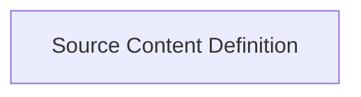

<!-- AUTO_GENERATED_PLACEHOLDER
  reason: LLM did not create .md file for this module
  module_path: pydantic_ai_agent_core/ui_vercel_ai_adapter/vercel_ai_response_types/source_chunks/source_content_definition
  component_count: 2
  generated_at: 2026-04-06T06:47:34.938726
  TODO: Fix LLM prompt to handle small leaf modules
-->

# Source Content Definition

> ⚠️ **Auto-Generated Placeholder**
> This documentation was auto-generated because the LLM failed to create it.
> Module path: `pydantic_ai_agent_core/ui_vercel_ai_adapter/vercel_ai_response_types/source_chunks/source_content_definition`

Defines data structures for representing source URLs and documents within streamed AI responses, used for providing citations or contextual information.

## Components

This module contains 2 component(s):

- `pydantic_ai_slim.pydantic_ai.ui.vercel_ai.response_types.SourceUrlChunk`
- `pydantic_ai_slim.pydantic_ai.ui.vercel_ai.response_types.SourceDocumentChunk`

## Structure

---
*Auto-generated placeholder. See sync_issues.json for details.*
