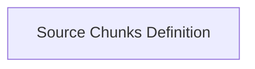

# Source Information Chunks Module

## Introduction

The `source_information_chunks` module is a crucial part of the UI component within the `pydantic_ai_agent_core` system. It provides standardized data structures for representing external source information, such as URLs and documents, that are displayed in user interfaces. This ensures that the UI can effectively present contextual data related to agent responses, enhancing transparency and user understanding.

## Architecture

This module primarily defines the structure of source information chunks, which are then used by higher-level UI components. It is a sub-module of the `vercel_ai_response_types` module, which focuses on defining various response types for the Vercel AI integration.

<!-- DIAGRAM_JSON
{
    "direction": "TD",
    "nodes": [
        {"id": "source_chunks_definition", "label": "Source Chunks Definition", "type": "module", "link": "source_chunks_definition.md"}
    ],
    "edges": [],
    "groups": []
}
-->

## Sub-modules

The `source_information_chunks` module is organized into the following sub-module:

### [Source Chunks Definition](source_chunks_definition.md)
Defines data structures for representing source URLs and documents within UI responses, providing rich context to the user interface. It encapsulates the core data models for `SourceUrlChunk` and `SourceDocumentChunk`.

## Integration with other modules

This module integrates with the broader [vercel_ai_response_types](vercel_ai_response_types.md) module, providing specific chunk types for source information. These chunks are designed to be consumed by UI rendering logic to present rich contextual data to the end-user.