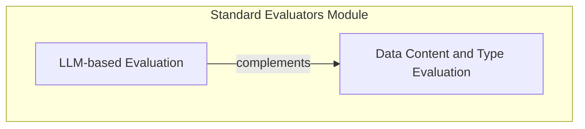

# Standard Evaluators

## Introduction

The `standard_evaluators` module within the `pydantic_evals_framework` provides a collection of commonly used evaluators for assessing the outputs of language models and other system components. These evaluators are designed to be flexible and extensible, allowing users to quickly integrate robust evaluation capabilities into their workflows. This module is crucial for verifying the correctness, format, and quality of generated responses.

## Architecture Overview

The `standard_evaluators` module is logically divided into two primary sub-modules:

*   **LLM-based Evaluation**: Focuses on evaluators that leverage large language models (LLMs) to perform nuanced judgments based on provided rubrics.
*   **Data Content and Type Evaluation**: Provides evaluators for direct inspection of output data, such as checking for specific content, substrings, or verifying the type of the output.

These sub-modules work in conjunction to offer a comprehensive suite of evaluation tools, enabling both qualitative (LLM-judged) and quantitative (direct comparison) assessments.

<!-- DIAGRAM_JSON
{
    "direction": "TD",
    "nodes": [
        {"id": "llm_based_evaluators", "label": "LLM-based Evaluation", "type": "module", "link": "llm_based_evaluators.md"},
        {"id": "data_content_evaluators", "label": "Data Content and Type Evaluation", "type": "module", "link": "data_content_evaluators.md"}
    ],
    "edges": [
        {"source": "llm_based_evaluators", "target": "data_content_evaluators", "label": "complements"}
    ],
    "groups": [
        {
            "id": "evaluation_types",
            "label": "Evaluation Types",
            "role": "analytical",
            "nodes": ["llm_based_evaluators", "data_content_evaluators"]
        }
    ]
}
-->

## Sub-modules

### [LLM-based Evaluation](llm_based_evaluators.md)
This sub-module contains evaluators that leverage Language Models to judge outputs against defined rubrics. It provides a powerful way to assess subjective quality and adherence to complex criteria.

### [Data Content and Type Evaluation](data_content_evaluators.md)
This sub-module offers evaluators for direct inspection of data. It includes tools for checking if an output contains specific values or substrings, and for verifying the type of the output. This is useful for objective, programmatic checks.