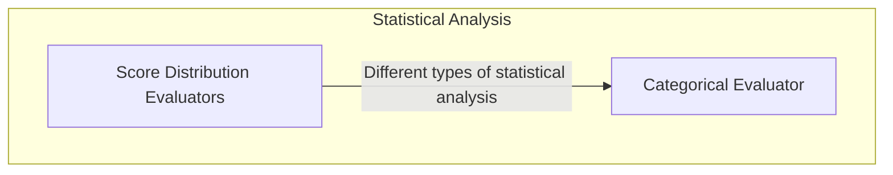

# Statistical Report Evaluators Module

## Introduction and Purpose

The `statistical_report_evaluators` module is a crucial part of the `pydantic_evals_framework` responsible for computing various statistical metrics and generating insightful reports based on evaluation case data. It provides a set of evaluators designed to analyze model performance, particularly in classification and ranking tasks, by offering metrics such as ROC AUC, Precision-Recall, Kolmogorov-Smirnov statistics, and Confusion Matrices. This module helps users understand the strengths and weaknesses of their models through quantitative analysis and visual representations.

## Architecture Overview

This module is structured into two main sub-modules, each focusing on a distinct type of statistical analysis:
*   **Score Distribution Evaluators**: Handles metrics derived from score distributions against binary outcomes.
*   **Categorical Evaluator**: Focuses on metrics for categorical predictions.

These sub-modules interact with the core evaluation framework to extract case data and then apply their specific statistical computations to generate `ReportAnalysis` objects, which can include plots and scalar results.

## High-Level Functionality

### Score Distribution Evaluators
This sub-module ([score_distribution_evaluators.md](score_distribution_evaluators.md)) includes evaluators that analyze numerical scores from model outputs or metrics against a binary positive/negative classification. It provides tools for:
*   **ROCAUCEvaluator**: Computes the Receiver Operating Characteristic (ROC) curve and the Area Under the Curve (AUC), useful for evaluating binary classification models at various threshold settings.
*   **PrecisionRecallEvaluator**: Generates a Precision-Recall curve and its AUC, which is particularly informative for imbalanced datasets where the positive class is rare.
*   **KolmogorovSmirnovEvaluator**: Calculates the Kolmogorov-Smirnov (KS) statistic by plotting the empirical cumulative distribution functions (CDFs) for positive and negative cases, indicating the separation power of a score.

### Categorical Evaluator
This sub-module ([categorical_evaluator.md](categorical_evaluator.md)) focuses on evaluating models that produce categorical predictions.
*   **ConfusionMatrixEvaluator**: Computes a confusion matrix, providing a detailed breakdown of true positives, true negatives, false positives, and false negatives for multi-class or binary classification problems.

<!-- DIAGRAM_JSON
{
    "direction": "TD",
    "nodes": [
        {
            "id": "statistical_report_evaluators",
            "label": "Statistical Report Evaluators",
            "type": "module"
        },
        {
            "id": "score_distribution_evaluators",
            "label": "Score Distribution Evaluators",
            "type": "module",
            "link": "score_distribution_evaluators.md"
        },
        {
            "id": "categorical_evaluator",
            "label": "Categorical Evaluator",
            "type": "module",
            "link": "categorical_evaluator.md"
        }
    ],
    "edges": [
        {
            "source": "score_distribution_evaluators",
            "target": "categorical_evaluator",
            "label": "provides different analysis types"
        }
    ],
    "groups": [
        {
            "id": "statistical_analysis",
            "label": "Statistical Analysis",
            "role": "analytical",
            "nodes": [
                "score_distribution_evaluators",
                "categorical_evaluator"
            ]
        }
    ]
}
-->

