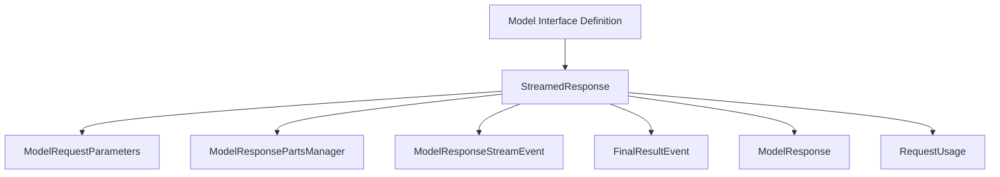

# Streamed Response Handling Module

## Introduction

The `streamed_response_handling` module provides the foundational abstract interface for managing and processing streamed responses from Large Language Models (LLMs). It defines the `StreamedResponse` abstract base class, which is crucial for handling real-time data chunks, transforming them into a structured sequence of events, and ultimately assembling a complete `ModelResponse`.

This module is a key component within the `pydantic_ai_models` ecosystem, ensuring a consistent approach to streaming data across various LLM integrations.

## Architecture and Component Relationships

The `streamed_response_handling` module centers around the `StreamedResponse` abstract base class. This class orchestrates the streaming process, managing events, accumulating response parts, and tracking usage.

<!-- DIAGRAM_JSON
{
    "direction": "TD",
    "nodes": [
        {"id": "streamed_response", "label": "StreamedResponse", "type": "component", "link": null},
        {"id": "model_request_parameters", "label": "ModelRequestParameters", "type": "external", "link": "pydantic_ai_models.md"},
        {"id": "model_response_parts_manager", "label": "ModelResponsePartsManager", "type": "external", "link": "tool_output_management.md"},
        {"id": "model_response_stream_event", "label": "ModelResponseStreamEvent", "type": "external", "link": "pydantic_ai_models.md"},
        {"id": "final_result_event", "label": "FinalResultEvent", "type": "external", "link": "pydantic_ai_models.md"},
        {"id": "model_response", "label": "ModelResponse", "type": "external", "link": "pydantic_ai_models.md"},
        {"id": "request_usage", "label": "RequestUsage", "type": "external", "link": "agent_utilities_results.md"},
        {"id": "model_interface_definition", "label": "Model Interface Definition", "type": "external", "link": "model_interface_definition.md"}
    ],
    "edges": [
        {"source": "streamed_response", "target": "model_request_parameters"},
        {"source": "streamed_response", "target": "model_response_parts_manager"},
        {"source": "streamed_response", "target": "model_response_stream_event"},
        {"source": "streamed_response", "target": "final_result_event"},
        {"source": "streamed_response", "target": "model_response"},
        {"source": "streamed_response", "target": "request_usage"},
        {"source": "model_interface_definition", "target": "streamed_response"}
    ],
    "groups": []
}
-->

### Core Components

#### `StreamedResponse`

The `StreamedResponse` (defined in `pydantic_ai_slim.pydantic_ai.models.__init__.py`) is an abstract base class that provides a standardized interface for handling streamed responses from language models. Its primary responsibilities include:

*   **Event Iteration**: It provides an asynchronous iterator (`__aiter__`) that yields `ModelResponseStreamEvent`s. This iterator handles the internal logic of emitting events, including `PartStartEvent` and `PartEndEvent`, and detects when a `FinalResultEvent` can be emitted based on the `ModelRequestParameters`.
*   **Part Management**: It utilizes a `ModelResponsePartsManager` to accumulate and manage the various parts (e.g., text, tool calls) received during the streaming process.
*   **Usage Tracking**: It tracks the `RequestUsage` of the streamed response, providing insights into token consumption and other metrics.
*   **Result Assembly**: The `get()` method allows for building a complete `ModelResponse` from the accumulated parts and metadata at any point during or after the stream has concluded.
*   **Abstract Methods**: Subclasses must implement `_get_event_iterator`, `model_name`, `provider_name`, `provider_url`, and `timestamp` to provide vendor-specific streaming logic and metadata.

### Dependencies

*   [`ModelRequestParameters`](pydantic_ai_models.md): An input parameter to `StreamedResponse` that guides the processing of the stream, particularly in determining when a `FinalResultEvent` is found.
*   [`ModelResponsePartsManager`](tool_output_management.md): Manages the accumulation and organization of individual parts received from the streaming LLM. This is a crucial component for reconstructing the full model response from deltas.
*   [`ModelResponseStreamEvent`](pydantic_ai_models.md): The base class for all events emitted by the `StreamedResponse` iterator, representing various stages and types of data received from the LLM stream.
*   [`FinalResultEvent`](pydantic_ai_models.md): A specific type of `ModelResponseStreamEvent` that signifies the completion of a meaningful result from the LLM, often corresponding to a structured output or tool call.
*   [`ModelResponse`](pydantic_ai_models.md): The final, complete response object that can be constructed from the streamed events and accumulated parts.
*   [`RequestUsage`](agent_utilities_results.md): An object used to track and report the resource consumption (e.g., token counts) during the streaming process.

## Integration with the Overall System

The `streamed_response_handling` module, through its `StreamedResponse` abstraction, plays a vital role in the `pydantic_ai_models` module. It serves as the standard contract for any LLM integration that supports streaming, ensuring that regardless of the underlying LLM provider (e.g., Gemini, OpenAI), the client-side consumption of streamed responses remains consistent.

This module enables the `pydantic_ai` framework to:

*   **Abstract Provider Differences**: By defining a common interface for streaming, it allows for seamless integration of various LLM providers, each implementing its own `_get_event_iterator` to translate vendor-specific stream formats into `pydantic_ai`-compatible events.
*   **Facilitate Real-time Interactions**: It underpins real-time applications where partial responses or intermediate steps from an LLM are crucial for a responsive user experience.
*   **Support Tool Use and Structured Outputs**: The event-driven nature, particularly with `PartStartEvent`, `PartEndEvent`, and `FinalResultEvent`, is essential for handling complex streamed outputs that include tool calls and structured data, enabling the agent to react dynamically to the LLM's ongoing generation.

Essentially, this module is the backbone for any asynchronous and incremental processing of LLM outputs within the `pydantic_ai` framework, ensuring that even complex, multi-turn interactions can be managed efficiently and consistently.))
