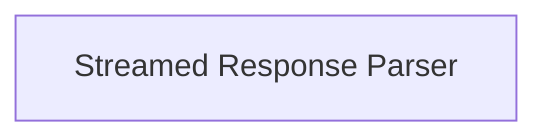

<!-- AUTO_GENERATED_PLACEHOLDER
  reason: LLM did not create .md file for this module
  module_path: pydantic_ai_agent_core/model_provider_openai/openai_response_handling/streamed_response_parser
  component_count: 1
  generated_at: 2026-04-06T06:47:34.934244
  TODO: Fix LLM prompt to handle small leaf modules
-->

# Streamed Response Parser

> ⚠️ **Auto-Generated Placeholder**
> This documentation was auto-generated because the LLM failed to create it.
> Module path: `pydantic_ai_agent_core/model_provider_openai/openai_response_handling/streamed_response_parser`

Manages the parsing and interpretation of streamed chunks from OpenAI models, handling usage, finish reasons, and different content deltas (thinking, text, tool calls).

## Components

This module contains 1 component(s):

- `pydantic_ai_slim.pydantic_ai.models.openai.OpenAIStreamedResponse`

## Structure

---
*Auto-generated placeholder. See sync_issues.json for details.*
