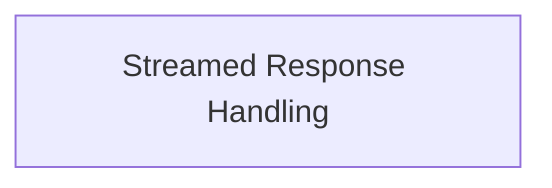

<!-- AUTO_GENERATED_PLACEHOLDER
  reason: LLM did not create .md file for this module
  module_path: pydantic_ai_agent_core/model_core_interfaces/streamed_responses
  component_count: 1
  generated_at: 2026-04-06T06:47:34.931715
  TODO: Fix LLM prompt to handle small leaf modules
-->

# Streamed Response Handling

> ⚠️ **Auto-Generated Placeholder**
> This documentation was auto-generated because the LLM failed to create it.
> Module path: `pydantic_ai_agent_core/model_core_interfaces/streamed_responses`

Manages the processing and delivery of streamed responses from language models, including event handling and final result generation.

## Components

This module contains 1 component(s):

- `pydantic_ai_slim.pydantic_ai.models.__init__.StreamedResponse`

## Structure

---
*Auto-generated placeholder. See sync_issues.json for details.*
