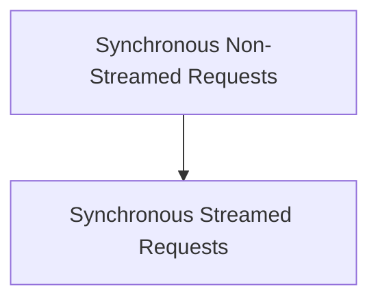

# Synchronous Model Requests

The `synchronous_model_requests` module provides a synchronous interface for interacting with various AI models. It wraps asynchronous model request functionalities, allowing them to be called in a blocking manner, which is useful in contexts where an active event loop is not desired or available.

## Architecture Overview

The module is composed of two primary sub-modules:
- `synchronous_non_streamed_requests`: For making single, non-streamed requests that return a complete model response.
- `synchronous_streamed_requests`: For making streamed requests that provide an iterator interface for consuming parts of the model response as they become available.

<!-- DIAGRAM_JSON
{
    "direction": "TD",
    "nodes": [
        {"id": "synchronous_non_streamed_requests", "label": "Synchronous Non-Streamed Requests", "type": "module", "link": "synchronous_non_streamed_requests.md"},
        {"id": "synchronous_streamed_requests", "label": "Synchronous Streamed Requests", "type": "module", "link": "synchronous_streamed_requests.md"}
    ],
    "edges": [
        {"source": "synchronous_non_streamed_requests", "target": "synchronous_streamed_requests"}
    ],
    "groups": []
}
-->

## Sub-modules

### [Synchronous Non-Streamed Requests](synchronous_non_streamed_requests.md)
Manages synchronous, non-streamed requests to AI models, returning a complete response.

### [Synchronous Streamed Requests](synchronous_streamed_requests.md)
Handles synchronous, streamed requests to AI models, providing an iterator interface.