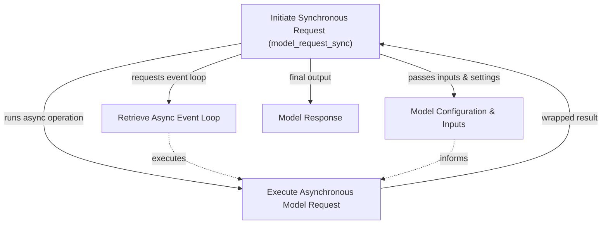

# Synchronous Requests Module

The `synchronous_requests` module provides a straightforward way to make synchronous, non-streamed requests to large language models. It acts as a convenient wrapper around the core asynchronous model request functionality, allowing developers to integrate AI model interactions into synchronous codebases without explicit asynchronous programming constructs.

## Core Functionality

This module's primary function is to abstract away the asynchronous nature of model interactions, providing a simple, blocking call for immediate responses. It is particularly useful for scripts or applications that do not require concurrent operations or an active event loop for model requests.

### `model_request_sync`

The `model_request_sync` function is the main entry point for making synchronous model requests. It takes the model identifier, a sequence of messages, and optional model settings or request parameters. Internally, it manages the asynchronous execution by leveraging an event loop to complete the underlying asynchronous model request.

**Key Features:**
*   **Synchronous Execution:** Blocks until the model response is fully received.
*   **Simplified Interface:** Hides the complexities of asynchronous programming.
*   **Direct Model Interaction:** Ideal for single, non-streaming requests.

## Architecture

The `synchronous_requests` module orchestrates the synchronous execution of an inherently asynchronous process. It relies on the system's event loop to run the asynchronous model request and then returns the result once complete.

<!-- DIAGRAM_JSON
{
    "direction": "TD",
    "nodes": [
        {
            "id": "sync_req",
            "label": "Initiate Synchronous Request (model_request_sync)",
            "type": "component",
            "link": null
        },
        {
            "id": "event_loop",
            "label": "Retrieve Async Event Loop",
            "type": "external",
            "link": "agent_utilities.md"
        },
        {
            "id": "async_req",
            "label": "Execute Asynchronous Model Request",
            "type": "external",
            "link": "direct_model_requests.md"
        },
        {
            "id": "model_params",
            "label": "Model Configuration & Inputs",
            "type": "external",
            "link": "model_core_interfaces.md"
        },
        {
            "id": "response_out",
            "label": "Model Response",
            "type": "external",
            "link": "model_core_interfaces.md"
        }
    ],
    "edges": [
        {
            "source": "sync_req",
            "target": "event_loop",
            "label": "requests event loop"
        },
        {
            "source": "sync_req",
            "target": "model_params",
            "label": "passes inputs & settings"
        },
        {
            "source": "sync_req",
            "target": "async_req",
            "label": "runs async operation"
        },
        {
            "source": "event_loop",
            "target": "async_req",
            "label": "executes"
        },
        {
            "source": "model_params",
            "target": "async_req",
            "label": "informs"
        },
        {
            "source": "async_req",
            "target": "sync_req",
            "label": "wrapped result"
        },
        {
            "source": "sync_req",
            "target": "response_out",
            "label": "final output"
        }
    ],
    "groups": []
}
-->

## How It Works

1.  **Initiation:** A call to `model_request_sync` is made with the desired model, messages, and optional configurations.
2.  **Event Loop Retrieval:** The function first retrieves the current event loop using utilities from the [agent_utilities](agent_utilities.md) module. This is crucial for running asynchronous code in a synchronous context.
3.  **Asynchronous Delegation:** It then delegates the actual model interaction to an underlying asynchronous `model_request` function (part of the [direct_model_requests](direct_model_requests.md) module). This function handles the communication with the large language model.
4.  **Blocking Execution:** The `run_until_complete` method of the event loop is used to execute the asynchronous model request. This effectively blocks the `model_request_sync` call until the asynchronous operation finishes.
5.  **Response Handling:** Once the asynchronous request completes, its result (a `ModelResponse` from [model_core_interfaces](model_core_interfaces.md)) is returned by `model_request_sync`.

## Integration with Other Modules

*   **[Direct Model Requests](direct_model_requests.md):** This module is a synchronous facade over the asynchronous model request capabilities defined in the `direct_model_requests` module.
*   **[Agent Utilities](agent_utilities.md):** Relies on `_get_event_loop` from `agent_utilities` to manage asynchronous execution in a synchronous context.
*   **[Model Core Interfaces](model_core_interfaces.md):** Utilizes core interfaces like `Model`, `ModelMessage`, and `ModelResponse` for defining inputs and outputs of model interactions.
*   **[Model Provider Configurations](model_provider_configurations.md):** Model-specific settings and parameters, such as `ModelSettings` and `ModelRequestParameters`, are passed to configure the underlying model request.
