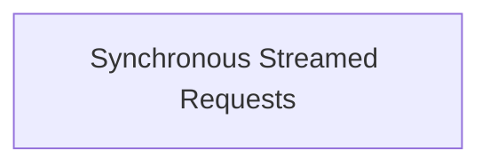

<!-- AUTO_GENERATED_PLACEHOLDER
  reason: LLM did not create .md file for this module
  module_path: pydantic_ai_agent_core/direct_model_requests/synchronous_streamed_requests
  component_count: 1
  generated_at: 2026-04-06T06:47:34.932029
  TODO: Fix LLM prompt to handle small leaf modules
-->

# Synchronous Streamed Requests

> ⚠️ **Auto-Generated Placeholder**
> This documentation was auto-generated because the LLM failed to create it.
> Module path: `pydantic_ai_agent_core/direct_model_requests/synchronous_streamed_requests`

Offers a synchronous iterator interface for consuming streamed responses from AI models, wrapping an asynchronous stream.

## Components

This module contains 1 component(s):

- `pydantic_ai_slim.pydantic_ai.direct.model_request_stream_sync`

## Structure

---
*Auto-generated placeholder. See sync_issues.json for details.*
