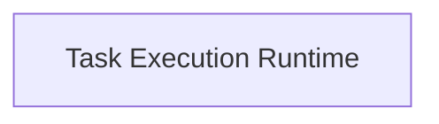

<!-- AUTO_GENERATED_PLACEHOLDER
  reason: LLM did not create .md file for this module
  module_path: pydantic_evals_framework/dataset_management/task_execution_runtime
  component_count: 1
  generated_at: 2026-04-06T06:47:34.944040
  TODO: Fix LLM prompt to handle small leaf modules
-->

# Task Execution Runtime

> ⚠️ **Auto-Generated Placeholder**
> This documentation was auto-generated because the LLM failed to create it.
> Module path: `pydantic_evals_framework/dataset_management/task_execution_runtime`

Manages the execution environment for individual tasks within a dataset, including concurrency and performance tracking.

## Components

This module contains 1 component(s):

- `pydantic_evals.pydantic_evals.dataset._run_once`

## Structure

---
*Auto-generated placeholder. See sync_issues.json for details.*
