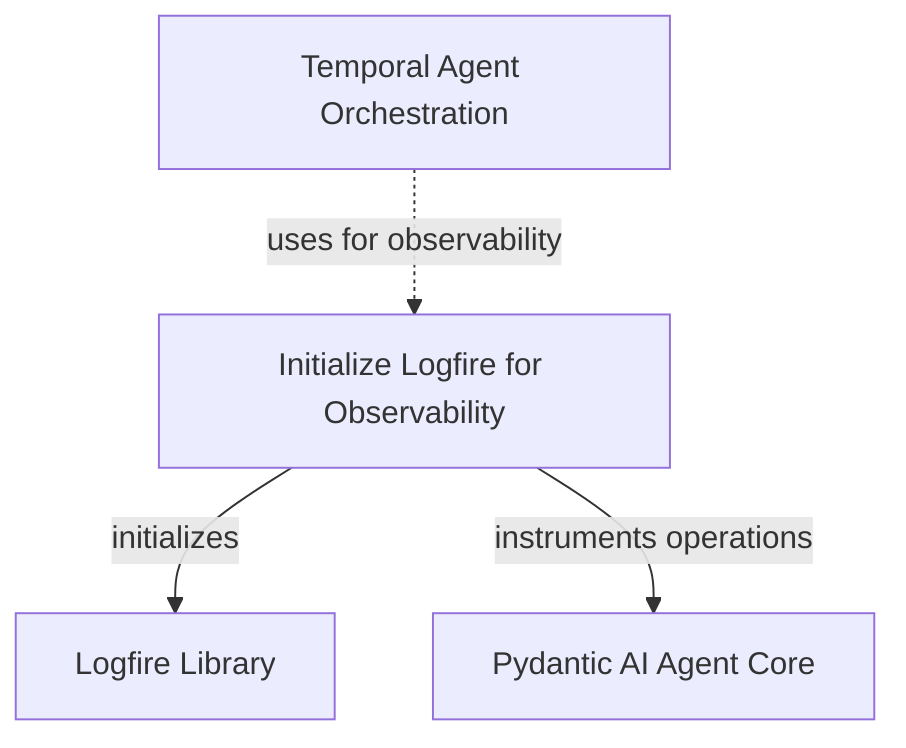

# Temporal Observability

The `temporal_observability` module provides essential components for integrating observability into AI agent workflows orchestrated by Temporal. It focuses on setting up logging and tracing capabilities, allowing developers to gain deep insights into the execution of `pydantic-ai` agents within a durable Temporal environment.

## Why Temporal Observability Matters

In complex AI agent systems, understanding the flow of execution, identifying bottlenecks, and debugging issues can be challenging, especially in distributed and long-running workflows like those managed by Temporal. This module bridges that gap by enabling detailed monitoring, ensuring that every interaction, decision, and tool call within a `pydantic-ai` agent's Temporal run can be traced and analyzed. This is crucial for:

*   **Debugging:** Pinpointing the exact step where an error occurred.
*   **Performance Monitoring:** Identifying slow operations or resource-intensive tasks.
*   **Auditing:** Maintaining a clear record of agent activities.
*   **Understanding Agent Behavior:** Gaining insights into how agents make decisions and interact with their environment.

## Module Architecture

The `temporal_observability` module centers around configuring an observability framework, specifically `logfire`, to instrument `pydantic-ai` operations within Temporal workflows. The primary component ensures that as agents execute, relevant telemetry data is captured and made available for analysis.

<!-- DIAGRAM_JSON
{
    "direction": "TD",
    "nodes": [
        {"id": "setup_logfire", "label": "Initialize Logfire for Observability", "type": "component", "link": null},
        {"id": "logfire_lib", "label": "Logfire Library", "type": "external", "link": null},
        {"id": "temporal_agent_orchestration", "label": "Temporal Agent Orchestration", "type": "external", "link": "temporal_agent_orchestration.md"},
        {"id": "pydantic_ai_agent_core", "label": "Pydantic AI Agent Core", "type": "external", "link": "pydantic_ai_agent_core.md"}
    ],
    "edges": [
        {"source": "setup_logfire", "target": "logfire_lib", "label": "initializes"},
        {"source": "setup_logfire", "target": "pydantic_ai_agent_core", "label": "instruments operations"},
        {"source": "temporal_agent_orchestration", "target": "setup_logfire", "label": "uses for observability"}
    ],
    "groups": []
}
-->



## Core Components

### `_default_setup_logfire`

This function is responsible for initializing and configuring the `logfire` observability library. It ensures that `logfire` is set up to capture and report events from `pydantic-ai` operations, providing a foundational layer for observability within Temporal workflows.

**Key Functionality:**

*   **Logfire Configuration:** Instantiates and configures the `logfire` global instance.
*   **Pydantic-AI Instrumentation:** Automatically instruments `pydantic-ai` to emit traces and logs for its internal operations, such as model calls, tool executions, and agent decisions.

**Usage:**

This function is typically invoked at the start of a Temporal workflow or activity that involves `pydantic-ai` agents to ensure that all subsequent operations are properly instrumented. It provides a default, convenient way to enable comprehensive observability without extensive manual configuration.

**Code:**
```python
def _default_setup_logfire() -> Logfire:
    import logfire

    instance = logfire.configure()
    instance.instrument_pydantic_ai()
    return instance
```
