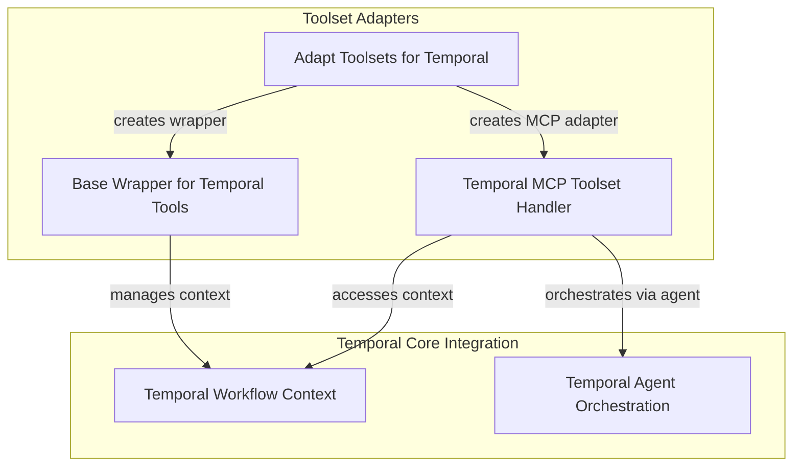

# temporal_toolset_adapters Module Documentation

## Introduction and Purpose

The `temporal_toolset_adapters` module is a crucial component within the durable execution framework, specifically designed to integrate Pydantic AI's toolsets with the Temporal workflow engine. Its primary purpose is to enable the execution of agent tools as reliable, fault-tolerant Temporal activities, ensuring that complex AI agent operations can be resumed, retried, and observed within a distributed environment. This module facilitates the seamless transition of local toolset calls into Temporal-managed activities, providing robustness and scalability for AI applications.

## Architecture Overview

The `temporal_toolset_adapters` module acts as a bridge, transforming standard Pydantic AI toolsets into their Temporal-compatible counterparts. It leverages the Temporal workflow paradigm to encapsulate tool executions as activities, making them resilient to failures and enabling long-running operations. The core architecture involves wrapping existing toolsets with Temporal-specific logic, handling serialization of run contexts and tool arguments, and dispatching tool calls as Temporal activities.

<!-- DIAGRAM_JSON
{
    "direction": "TD",
    "nodes": [
        {
            "id": "temporal_toolset_adapters",
            "label": "Temporal Toolset Adapters",
            "type": "module"
        },
        {
            "id": "temporalize_toolset_functionality",
            "label": "Toolset Temporalization",
            "type": "module",
            "link": "temporalize_toolset_functionality.md"
        },
        {
            "id": "temporal_wrapper_toolset_base",
            "label": "Base Temporal Toolset Wrapper",
            "type": "module",
            "link": "temporal_wrapper_toolset_base.md"
        },
        {
            "id": "temporal_mcp_toolset_implementation",
            "label": "Temporal MCP Toolset",
            "type": "module",
            "link": "temporal_mcp_toolset_implementation.md"
        },
        {
            "id": "temporal_workflow_context",
            "label": "Temporal Workflow Context",
            "type": "module",
            "link": "temporal_workflow_context.md"
        },
        {
            "id": "temporal_agent_orchestration",
            "label": "Temporal Agent Orchestration",
            "type": "module",
            "link": "temporal_agent_orchestration.md"
        }
    ],
    "edges": [
        {
            "source": "temporalize_toolset_functionality",
            "target": "temporal_wrapper_toolset_base",
            "label": "creates wrapper"
        },
        {
            "source": "temporalize_toolset_functionality",
            "target": "temporal_mcp_toolset_implementation",
            "label": "creates MCP adapter"
        },
        {
            "source": "temporal_mcp_toolset_implementation",
            "target": "temporal_workflow_context",
            "label": "accesses context"
        },
        {
            "source": "temporal_wrapper_toolset_base",
            "target": "temporal_workflow_context",
            "label": "manages context"
        },
        {
            "source": "temporal_mcp_toolset_implementation",
            "target": "temporal_agent_orchestration",
            "label": "orchestrates via agent"
        }
    ],
    "groups": [
        {
            "id": "adapters",
            "label": "Toolset Adapters",
            "role": "generative",
            "nodes": [
                "temporalize_toolset_functionality",
                "temporal_wrapper_toolset_base",
                "temporal_mcp_toolset_implementation"
            ]
        },
        {
            "id": "temporal_core",
            "label": "Temporal Core Integration",
            "role": "data",
            "nodes": [
                "temporal_workflow_context",
                "temporal_agent_orchestration"
            ]
        }
    ]
}
-->

## High-Level Functionality of Sub-modules

This module is composed of the following key sub-modules, each contributing to the integration of Pydantic AI's toolsets with Temporal workflows:

*   ### [Toolset Temporalization](temporalize_toolset_functionality.md)
    This sub-module provides the core function to adapt various types of Pydantic AI toolsets (e.g., `FunctionToolset`, `DynamicToolset`, `MCPServer`, `FastMCPToolset`) into their Temporal-compatible versions. It configures them to run their operations as Temporal activities, ensuring durability and observability.

*   ### [Base Temporal Toolset Wrapper](temporal_wrapper_toolset_base.md)
    This abstract base class serves as the foundation for all Temporal-wrapped toolsets. It defines the common interface and logic for managing the lifecycle of wrapped toolsets within Temporal workflows, handling the wrapping of tool call results and their unwrapping after activity execution.

*   ### [Temporal MCP Toolset](temporal_mcp_toolset_implementation.md)
    This sub-module specifically implements the Temporal integration for Multi-Capability Protocol (MCP) toolsets. It defines Temporal activities for fetching instructions, listing available tools, and executing tools provided by an MCP server, ensuring that these interactions are durable and reliable within a Temporal workflow.
