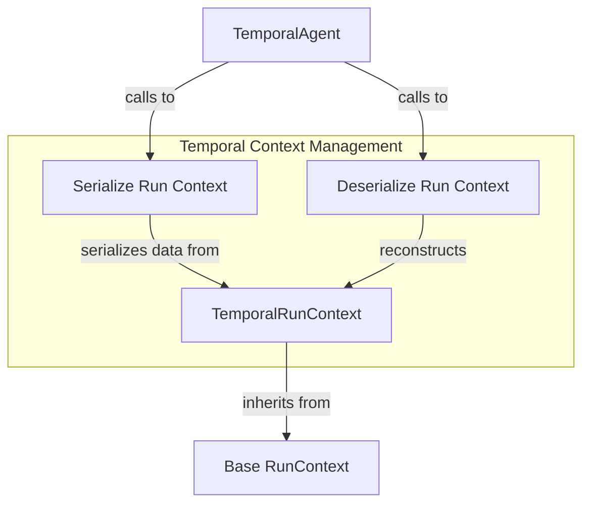

# temporal_workflow_context

The `temporal_workflow_context` module is a crucial component within the durable execution framework, specifically designed for integrating Pydantic-AI agents with Temporal workflows. Its primary role is to define and manage the execution context that is serialized, passed, and deserialized across Temporal activities. This ensures that the state and dependencies of an agent's run are consistently maintained and accessible throughout a long-running Temporal workflow.

## TemporalRunContext

The `TemporalRunContext` class is a specialized implementation of `RunContext` that facilitates the serialization and deserialization of an agent's execution state for use within Temporal activities. This class is essential for enabling stateful agent operations in a durable workflow environment.

### Purpose
In Temporal workflows, data passed between activities must be serializable. `TemporalRunContext` addresses this by providing methods to convert the rich `RunContext` object into a dictionary (serialization) and reconstruct it back into a `TemporalRunContext` instance (deserialization). This mechanism ensures that critical information like `run_id`, `metadata`, `tool_call_id`, `usage`, and partial outputs are preserved across asynchronous Temporal activity executions.

### Key Features:

*   **Selective Serialization**: By default, `TemporalRunContext` serializes a predefined set of `RunContext` attributes. This helps in keeping the serialized context lean and focused on necessary information for Temporal activities.
*   **Customizable Context**: Developers can extend `TemporalRunContext` by subclassing it and overriding the `serialize_run_context` class method. This allows for the inclusion of additional, custom attributes from the `RunContext` if specific workflow requirements demand it.
*   **Attribute Access Control**: It employs a strict attribute access mechanism. Any attempt to access an attribute not explicitly part of the serialized context will raise a `UserError`, guiding developers to either include it in a custom `TemporalRunContext` subclass or understand its unavailability.

### How it Works:

1.  **Initialization**: When a `TemporalRunContext` instance is created, it merges provided keyword arguments with a `deps` object, and selectively sets `__dataclass_fields__` to reflect only the attributes available in its internal dictionary.
2.  **Serialization (`serialize_run_context`)**: This class method takes a `RunContext` object and returns a `dict[str, Any]` containing the values of the allowed attributes. This dictionary is then passed as arguments to Temporal activities.
3.  **Deserialization (`deserialize_run_context`)**: This class method takes a `dict[str, Any]` (received from a Temporal activity) and an `AgentDepsT` object, reconstructing a `TemporalRunContext` instance with the previously serialized state. This allows the agent to resume execution with its correct context.

### Relationship with other modules:

*   **`durable_execution_temporal`**: `TemporalRunContext` is a foundational component for the `temporal_agent_orchestration.md` module, specifically used by the `TemporalAgent` to manage the agent's state during Temporal workflow execution.
*   **`pydantic_ai_agent_core`**: It extends the base `RunContext` concept, which is fundamental to agent execution within the broader `pydantic_ai_agent_core` framework.

<!-- DIAGRAM_JSON
{
    "direction": "TD",
    "nodes": [
        {"id": "temporal_run_context", "label": "TemporalRunContext", "type": "component", "link": null},
        {"id": "serialize_context", "label": "Serialize Run Context", "type": "component", "link": null},
        {"id": "deserialize_context", "label": "Deserialize Run Context", "type": "component", "link": null},
        {"id": "run_context", "label": "Base RunContext", "type": "external", "link": "pydantic_ai_agent_core.md"},
        {"id": "temporal_agent", "label": "TemporalAgent", "type": "external", "link": "temporal_agent_orchestration.md"}
    ],
    "edges": [
        {"source": "temporal_run_context", "target": "run_context", "label": "inherits from"},
        {"source": "temporal_agent", "target": "serialize_context", "label": "calls to"},
        {"source": "serialize_context", "target": "temporal_run_context", "label": "serializes data from"},
        {"source": "temporal_agent", "target": "deserialize_context", "label": "calls to"},
        {"source": "deserialize_context", "target": "temporal_run_context", "label": "reconstructs"}
    ],
    "groups": [
        {
            "id": "context_management",
            "label": "Temporal Context Management",
            "role": "analytical",
            "nodes": ["temporal_run_context", "serialize_context", "deserialize_context"]
        }
    ]
}
-->

