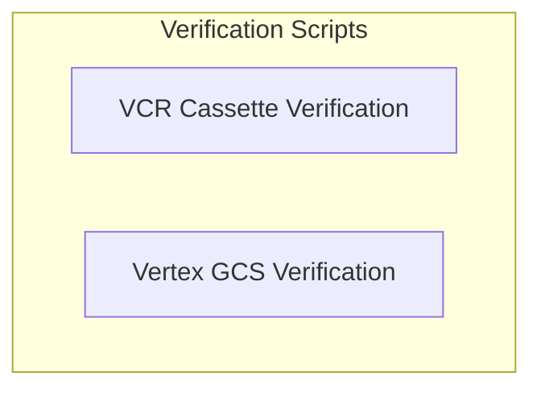

# Testing and Verification Module

## Introduction

The `testing_and_verification` module provides essential scripts for maintaining code quality and ensuring the correct functionality of integrations within the system. It includes utilities for validating VCR cassettes and verifying Vertex AI tool results with Google Cloud Storage (GCS) URIs.

## Architecture Overview

This module is composed of several independent scripts designed to perform specific verification tasks. While primarily standalone, they contribute to the overall reliability of the system's components and integrations.

<!-- DIAGRAM_JSON
{
    "direction": "TD",
    "nodes": [
        {
            "id": "testing_and_verification",
            "label": "Testing and Verification",
            "type": "module"
        },
        {
            "id": "vcr_cassette_verification",
            "label": "VCR Cassette Verification",
            "type": "module",
            "link": "vcr_cassette_verification.md"
        },
        {
            "id": "vertex_gcs_verification",
            "label": "Vertex GCS Verification",
            "type": "module",
            "link": "vertex_gcs_verification.md"
        }
    ],
    "edges": [],
    "groups": [
        {
            "id": "verification_scripts",
            "label": "Verification Scripts",
            "role": "analytical",
            "nodes": [
                "vcr_cassette_verification",
                "vertex_gcs_verification"
            ]
        }
    ]
}
-->

## Sub-modules

- ### [VCR Cassette Verification](vcr_cassette_verification.md)
  This sub-module contains scripts to ensure that all VCR cassettes used in tests have corresponding test cases. It helps identify and remove orphaned cassettes, preventing dead code.

- ### [Vertex GCS Verification](vertex_gcs_verification.md)
  This sub-module provides utilities for verifying the successful interaction of Vertex AI tools with various file types stored in Google Cloud Storage. It includes general and all-types verification checks.