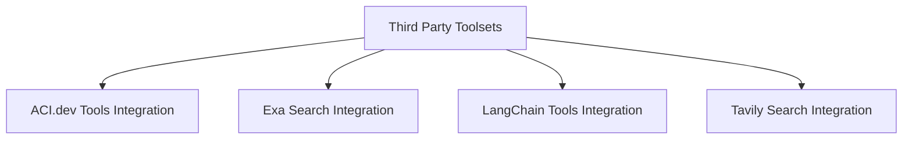

# Third-Party Toolsets Module Documentation

## Introduction

The `third_party_toolsets` module provides a consolidated interface for integrating various external tools and services into the pydantic_ai framework. This module acts as a bridge, allowing agents to leverage powerful functionalities from platforms like Exa, Tavily, ACI.dev, and LangChain, thereby expanding their capabilities for web search, content retrieval, and interaction with a diverse set of external APIs.

## Architecture Overview

The `third_party_toolsets` module is structured to encapsulate the specifics of each third-party integration, presenting a unified `FunctionToolset` interface to the agent. Each integrated toolset manages its own client and configuration, ensuring modularity and ease of maintenance. The module itself orchestrates the inclusion and initialization of these toolsets based on the application's requirements.

<!-- DIAGRAM_JSON
{
    "direction": "TD",
    "nodes": [
        {"id": "third_party_toolsets", "label": "Third Party Toolsets", "type": "module"},
        {"id": "aci_integration", "label": "ACI.dev Tools Integration", "type": "module", "link": "aci_integration.md"},
        {"id": "exa_integration", "label": "Exa Search Integration", "type": "module", "link": "exa_integration.md"},
        {"id": "langchain_integration", "label": "LangChain Tools Integration", "type": "module", "link": "langchain_integration.md"},
        {"id": "tavily_integration", "label": "Tavily Search Integration", "type": "module", "link": "tavily_integration.md"}
    ],
    "edges": [
        {"source": "third_party_toolsets", "target": "aci_integration"},
        {"source": "third_party_toolsets", "target": "exa_integration"},
        {"source": "third_party_toolsets", "target": "langchain_integration"},
        {"source": "third_party_toolsets", "target": "tavily_integration"}
    ],
    "groups": []
}
-->

## Sub-modules

### ACI.dev Tools Integration (`aci_integration.md`)
This sub-module facilitates the integration of tools available through ACI.dev, extending the agent's capabilities with external services.

### Exa Search Integration (`exa_integration.md`)
This sub-module integrates Exa's powerful search capabilities, allowing agents to perform web searches and retrieve content efficiently.

### LangChain Tools Integration (`langchain_integration.md`)
This sub-module allows seamless integration of LangChain tools, leveraging the extensive ecosystem of LangChain within the agent framework.

### Tavily Search Integration (`tavily_integration.md`)
This sub-module provides tools for integrating Tavily search functionality, enabling agents to conduct targeted web searches.
