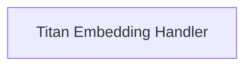

<!-- AUTO_GENERATED_PLACEHOLDER
  reason: LLM did not create .md file for this module
  module_path: pydantic_ai_agent_core/embedding_provider_integrations/bedrock_embedding_handlers/bedrock_embedding_model_handlers/titan_embedding_handler
  component_count: 1
  generated_at: 2026-04-06T06:47:34.934793
  TODO: Fix LLM prompt to handle small leaf modules
-->

# Titan Embedding Handler

> ⚠️ **Auto-Generated Placeholder**
> This documentation was auto-generated because the LLM failed to create it.
> Module path: `pydantic_ai_agent_core/embedding_provider_integrations/bedrock_embedding_handlers/bedrock_embedding_model_handlers/titan_embedding_handler`

Implements request preparation and response parsing for Amazon Titan embedding models on AWS Bedrock, supporting version-specific parameter adjustments.

## Components

This module contains 1 component(s):

- `pydantic_ai_slim.pydantic_ai.embeddings.bedrock._TitanEmbeddingHandler`

## Structure

---
*Auto-generated placeholder. See sync_issues.json for details.*
