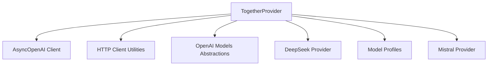

# together_provider

The `together_provider` module provides an integration with the Together AI API, allowing applications to leverage Together AI's language models within an OpenAI-compatible interface. It is a key component within the larger [pydantic_ai_providers](pydantic_ai_providers.md) module, specifically falling under the [openai_compatible_providers](openai_compatible_providers.md) category.

## Purpose and Core Functionality

The primary purpose of the `together_provider` module is to offer a robust and configurable `TogetherProvider` class that acts as a bridge to the Together AI platform. Its core functionalities include:

*   **API Key Management**: Securely handles the Together AI API key, either through direct instantiation or environment variables.
*   **OpenAI Client Integration**: Utilizes the `AsyncOpenAI` client (from the `openai` library) to communicate with the Together AI API, ensuring compatibility with existing OpenAI-based integrations.
*   **Base URL Configuration**: Defines the standard API endpoint for Together AI.
*   **Dynamic Model Profile Handling**: Automatically determines and applies appropriate model profiles based on the requested model name, supporting various sub-providers like DeepSeek, Google, Qwen, Meta Llama, and Mistral AI. It defaults to an `OpenAIModelProfile` with `OpenAIJsonSchemaTransformer` for OpenAI-compatible schema transformations.
*   **HTTP Client Caching**: Employs a cached asynchronous HTTP client for efficient and optimized network requests.

## Architecture and Component Relationships

The `together_provider` module is centered around the `TogetherProvider` class. This class orchestrates interactions with the Together AI API by managing an `AsyncOpenAI` client instance and dynamically selecting model profiles.

<!-- DIAGRAM_JSON
{
    "direction": "TD",
    "nodes": [
        {"id": "together_provider_class", "label": "TogetherProvider", "type": "component", "link": null},
        {"id": "async_openai_client", "label": "AsyncOpenAI Client", "type": "external", "link": null},
        {"id": "http_client_utils", "label": "HTTP Client Utilities", "type": "external", "link": null},
        {"id": "openai_models", "label": "OpenAI Models Abstractions", "type": "external", "link": "pydantic_ai_models.md"},
        {"id": "deepseek_provider", "label": "DeepSeek Provider", "type": "external", "link": "deepseek_provider.md"},
        {"id": "model_profiles", "label": "Model Profiles", "type": "external", "link": "model_profiles.md"},
        {"id": "mistral_provider", "label": "Mistral Provider", "type": "external", "link": "mistral_provider.md"}
    ],
    "edges": [
        {"source": "together_provider_class", "target": "async_openai_client"},
        {"source": "together_provider_class", "target": "http_client_utils"},
        {"source": "together_provider_class", "target": "openai_models"},
        {"source": "together_provider_class", "target": "deepseek_provider"},
        {"source": "together_provider_class", "target": "model_profiles"},
        {"source": "together_provider_class", "target": "mistral_provider"}
    ],
    "groups": []
}
-->


### Components

*   **`TogetherProvider`**: The central class for interacting with Together AI. It encapsulates the logic for client initialization, API key management, and model profile selection.

### External Dependencies

*   **`AsyncOpenAI`**: (From the `openai` library) Provides the underlying client for making API calls to Together AI, leveraging its OpenAI compatibility.
*   **HTTP Client Utilities**: (Such as `cached_async_http_client`) Handles the asynchronous HTTP communication, potentially with caching mechanisms for performance.
*   **[OpenAI Models Abstractions](pydantic_ai_models.md)**: Provides core abstractions like `ModelProfile`, `OpenAIModelProfile`, and `OpenAIJsonSchemaTransformer`, which are crucial for defining and transforming model configurations and schemas.
*   **[DeepSeek Provider](deepseek_provider.md)**: Referenced for `deepseek_model_profile`, used in dynamic model profile selection.
*   **[Model Profiles](model_profiles.md)**: A general reference for various model profiles, including `google_model_profile`, `qwen_model_profile`, and `meta_model_profile` that the `TogetherProvider` might utilize based on the model name.
*   **[Mistral Provider](mistral_provider.md)**: Referenced for `mistral_model_profile`, used in dynamic model profile selection.

## How the Module Fits into the Overall System

The `together_provider` module is an integral part of the larger `pydantic_ai` ecosystem, specifically within the `pydantic_ai_providers` package. It extends the system's capability to integrate with various AI model providers. As an [openai_compatible_provider](openai_compatible_providers.md), it adheres to a standardized interface, allowing other parts of the system, such as agents and tools, to interact with Together AI models seamlessly without needing to understand the underlying provider-specific nuances. This modular design enhances flexibility and allows for easy addition or swapping of different AI service providers.

## Usage Example

To use the `TogetherProvider`, you would typically instantiate it and then use its client to interact with Together AI models. Ensure your `TOGETHER_API_KEY` environment variable is set or pass it directly.

```python
import os
from pydantic_ai_slim.pydantic_ai.providers.together import TogetherProvider

# Option 1: Using environment variable (recommended)
# os.environ['TOGETHER_API_KEY'] = "YOUR_TOGETHER_AI_API_KEY"
provider = TogetherProvider()

# Option 2: Passing API key directly
# provider = TogetherProvider(api_key="YOUR_TOGETHER_AI_API_KEY")

client = provider.client
# Now you can use the client to interact with Together AI models,
# e.g., client.chat.completions.create(...)
```
