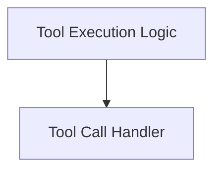

# tool_call_processing Module Documentation

The `tool_call_processing` module is a core component within the `pydantic_ai_agent_core` system, specifically residing within the `tool_execution_handlers` sub-module. Its primary responsibility is to manage the lifecycle of tool calls, from their initial execution to handling their outcomes, including deferred actions, approval requirements, and result processing. This module ensures robust and controlled interaction with external tools and internal functionalities within the AI agent's execution flow.

## Architecture Overview

The `tool_call_processing` module is composed of two main sub-modules: `tool_call_handler` and `tool_execution`. These modules work in tandem to facilitate the execution and subsequent handling of tool interactions within the agent's workflow.

<!-- DIAGRAM_JSON
{
    "direction": "TD",
    "nodes": [
        {"id": "tool_call_handler", "label": "Tool Call Handler", "type": "module", "link": "tool_call_handler.md"},
        {"id": "tool_execution", "label": "Tool Execution Logic", "type": "module", "link": "tool_execution.md"}
    ],
    "edges": [
        {"source": "tool_execution", "target": "tool_call_handler"}
    ],
    "groups": []
}
-->

## Sub-module Functionality

*   **Tool Call Handler ([tool_call_handler.md](tool_call_handler.md))**
    This sub-module is responsible for processing the various outcomes of tool calls, including successful returns, deferred calls, and those requiring explicit approval. It acts as an intermediary, interpreting the results and generating the appropriate internal messages or events for the agent's graph.

*   **Tool Execution Logic ([tool_execution.md](tool_execution.md))**
    This sub-module encapsulates the core logic for executing tool calls. It handles the validation of tool calls, manages the actual execution via the `ToolManager`, and processes different scenarios such as tool denials or requests for retry. It ensures that tool results are correctly formatted and returned to the agent's workflow.
