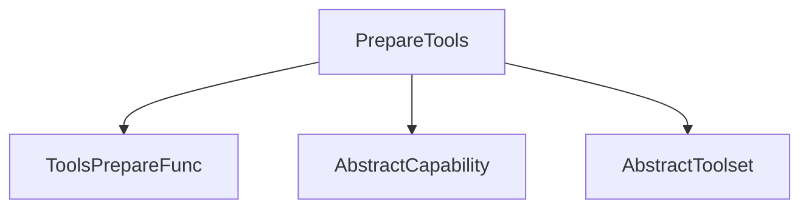

# `tool_definition_preparation` Module

## Introduction

The `tool_definition_preparation` module provides the `PrepareTools` capability, a crucial component for dynamically managing and modifying tool definitions within the Pydantic-AI agent system. This module enables agents to filter, transform, or enhance the set of tools available to them at runtime, allowing for flexible and context-aware tool usage.

## Architecture and Component Relationships

The `PrepareTools` class serves as the core of this module. It is an implementation of `AbstractCapability`, meaning it can be seamlessly integrated into an agent's capability stack. Its primary function is to wrap a `ToolsPrepareFunc`, which is a callable that takes a list of `ToolDefinition` objects and returns a modified list or `None`.

When an agent, equipped with the `PrepareTools` capability, needs to access its toolset, `PrepareTools` intercepts the process. It applies the configured `ToolsPrepareFunc` to the existing tool definitions, effectively customizing the toolset before it's presented to the agent. This allows for scenarios like hiding administrative tools from certain agents or modifying tool parameters based on the current operational context.

**Core Components:**

*   `PrepareTools`: The main class implementing the tool preparation logic. It inherits from [abstract_capability](capability_core.md) and uses a `ToolsPrepareFunc` to modify tool definitions.

### Diagram

<!-- DIAGRAM_JSON
{
    "direction": "TD",
    "nodes": [
        {"id": "prepare_tools", "label": "PrepareTools", "type": "component", "link": null},
        {"id": "tools_prepare_func", "label": "ToolsPrepareFunc", "type": "component", "link": null},
        {"id": "abstract_capability", "label": "AbstractCapability", "type": "external", "link": "capability_core.md"},
        {"id": "abstract_toolset", "label": "AbstractToolset", "type": "external", "link": "pydantic_ai_tools.md"}
    ],
    "edges": [
        {"source": "prepare_tools", "target": "abstract_capability"},
        {"source": "prepare_tools", "target": "tools_prepare_func"},
        {"source": "prepare_tools", "target": "abstract_toolset"}
    ],
    "groups": []
}
-->

## How it Fits into the Overall System

The `tool_definition_preparation` module is a part of the `pydantic_ai_capabilities.tool_integrations` module, which focuses on integrating various tools and capabilities into the Pydantic-AI framework. By providing the `PrepareTools` capability, this module enables a declarative and composable way to manage tool visibility and behavior.

Agents can be configured with `PrepareTools` to enforce security policies (e.g., restricting access to sensitive tools), optimize tool usage (e.g., filtering out irrelevant tools based on the current task), or to dynamically adapt their tool-using behavior in complex workflows. It acts as a middleware for tool definitions, ensuring that agents interact with a tailored and appropriate set of functionalities.

This capability significantly enhances the flexibility and adaptability of agents, allowing developers to create more sophisticated and context-aware AI systems without modifying the core agent logic for every tool management scenario. It relies on the broader [pydantic_ai_capabilities](pydantic_ai_capabilities.md) system for its integration and on [pydantic_ai_tools](pydantic_ai_tools.md) for the underlying tool definitions and toolset abstractions.