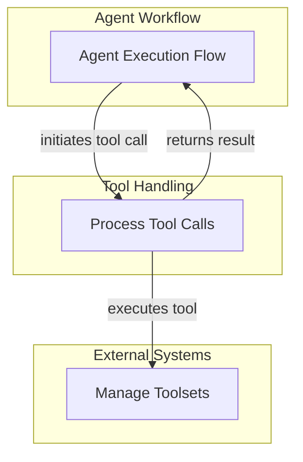

# Tool Execution Handlers

## Introduction
The `tool_execution_handlers` module is a crucial component within the `agent_execution_graph`, responsible for managing the invocation and processing of tool calls made by the AI agent. It ensures that external tools are executed correctly, their results are captured, and any necessary retries or approvals are handled efficiently. This module is vital for the agent's ability to interact with external systems and extend its capabilities beyond its core reasoning.

## Architecture Overview
This module primarily focuses on two key aspects: executing the actual tool calls and processing the outcomes of these executions. It acts as an intermediary between the agent's decision-making process and the various tools available to it, ensuring a robust and fault-tolerant mechanism for tool interaction.

<!-- DIAGRAM_JSON
{
    "direction": "TD",
    "nodes": [
        {
            "id": "tool_execution_handlers",
            "label": "Tool Execution Handlers",
            "type": "module"
        },
        {
            "id": "tool_call_processing",
            "label": "Process Tool Calls",
            "type": "module",
            "link": "tool_call_processing.md"
        },
        {
            "id": "toolset_management",
            "label": "Manage Toolsets",
            "type": "external"
        },
        {
            "id": "agent_execution_graph",
            "label": "Agent Execution Flow",
            "type": "external"
        }
    ],
    "edges": [
        {
            "source": "agent_execution_graph",
            "target": "tool_call_processing",
            "label": "initiates tool call"
        },
        {
            "source": "tool_call_processing",
            "target": "toolset_management",
            "label": "executes tool"
        },
        {
            "source": "tool_call_processing",
            "target": "agent_execution_graph",
            "label": "returns result"
        }
    ],
    "groups": [
        {
            "id": "tool_handling",
            "label": "Tool Handling",
            "role": "generative",
            "nodes": [
                "tool_call_processing"
            ]
        },
        {
            "id": "dependencies",
            "label": "Dependencies",
            "role": "data",
            "nodes": [
                "toolset_management",
                "agent_execution_graph"
            ]
        }
    ]
}
-->

## Sub-modules
This module is composed of the following sub-module:

### [Tool Call Processing](tool_call_processing.md)
This sub-module is responsible for the core logic of executing and handling the results of tool calls, including managing deferred actions and retries.
