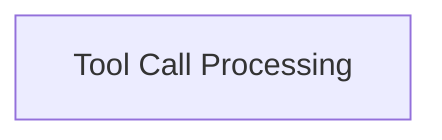

# Tool Execution Handlers

The `tool_execution_handlers` module is a crucial part of the `pydantic_ai_agent_core` within the `agent_execution_graph`. It is responsible for orchestrating the execution of tools called by the agent and processing their results. This module ensures that tool calls are handled correctly, whether they succeed, are deferred, or denied, and integrates their outcomes back into the agent's operational flow.

## Architecture Overview

This module sits within the `agent_execution_graph`, specifically handling the interaction with external tools or internal functions that an agent might invoke. It receives tool call requests, executes them via the `ToolManager`, and then processes the responses, converting them into a format that the agent's graph can further process. It also manages scenarios where tool execution might be deferred or require approval.

<!-- DIAGRAM_JSON
{
    "direction": "TD",
    "nodes": [
        {"id": "tool_call_processing", "label": "Tool Call Processing", "type": "module", "link": "tool_call_processing.md"}
    ],
    "edges": [],
    "groups": []
}
-->

## Sub-modules

### [Tool Call Processing](tool_call_processing.md)

This sub-module manages the execution and result handling of agent tool calls, including deferred and denied states. It contains the core logic for executing tool calls and processing their various outcomes, ensuring proper integration with the agent's message flow.
