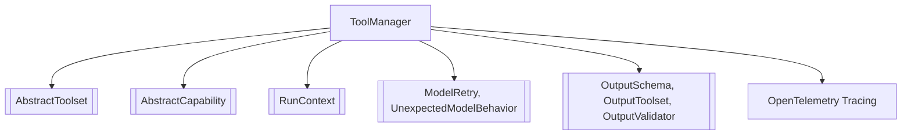

# `tool_execution_handling` Module Documentation

The `tool_execution_handling` module is a crucial part of the `pydantic_ai_agent_core` responsible for orchestrating the execution of tools within an agent's run step. Its primary component, `ToolManager`, ensures that tools are properly validated, executed, and retried when necessary, while also integrating with an observability framework for detailed tracing.

## Purpose and Core Functionality

The `tool_execution_handling` module, through its `ToolManager` class, provides a robust mechanism for managing the entire lifecycle of tool calls made by an AI agent. This includes:

1.  **Tool Definition Management**: Caching and providing access to tool definitions (`ToolDefinition`) from an `AbstractToolset`.
2.  **Argument Validation**: Validating tool arguments against their Pydantic schemas and custom validation functions, supporting both full and partial validation.
3.  **Execution Orchestration**: Executing tool calls, either sequentially or in parallel, and handling the results.
4.  **Retry Mechanism**: Implementing a retry policy for failed tool calls, raising `UnexpectedModelBehavior` if max retries are exceeded.
5.  **Capability Hook Integration**: Providing integration points (before, wrap, after hooks) for `AbstractCapability` to customize validation and execution logic.
6.  **Observability**: Integrating with OpenTelemetry for comprehensive tracing of function tool calls, capturing arguments, results, and potential deferrals or errors.
7.  **Run Context Management**: Building and maintaining a `RunContext` specific to each tool call, including retry counts and approval status.

## Architecture and Component Relationships

The `ToolManager` is the central component of this module. It is a generic class parameterized by `AgentDepsT`, representing agent-specific dependencies.

**`ToolManager` (Internal Component)**
The `ToolManager` class orchestrates tool interactions. Key internal mechanisms include:

*   **`toolset`**: An instance of `AbstractToolset` (from [pydantic_ai_tools](pydantic_ai_tools.md)), which is the source of all available tools and their definitions. `ToolManager` delegates the actual tool invocation to this toolset via `toolset.call_tool`.
*   **`root_capability`**: An optional instance of `AbstractCapability` (from [pydantic_ai_capabilities](pydantic_ai_capabilities.md)). This enables advanced customization through a series of hooks (`before_tool_validate`, `wrap_tool_validate`, `after_tool_validate`, `before_tool_execute`, `wrap_tool_execute`, `after_tool_execute`, `on_tool_validate_error`, `on_tool_execute_error`) that can modify arguments, results, or handle errors during validation and execution.
*   **`ctx`**: A `RunContext` (likely from [agent_utilities_results](agent_utilities_results.md) or `pydantic_ai_agent_core`), which provides the contextual information for the current agent run step, including retry counts, tracing objects, and other metadata.
*   **Validation Flow**: `_validate_tool_args` uses Pydantic schemas for initial argument validation. This process is wrapped by `_run_validate_hooks` to allow capability-defined interventions.
*   **Execution Flow**: `_raw_execute` performs the actual call to the `toolset`. This is wrapped by `_run_execute_hooks` for capability-defined interventions.
*   **Error Handling and Retries**: `_check_max_retries` enforces retry limits, and `_wrap_error_as_retry` converts validation or model retry errors into `ToolRetryError` containing a `RetryPromptPart` for the agent.
*   **Concurrency**: `parallel_execution_mode` (and the deprecated `sequential_tool_calls`) allows defining how multiple tool calls are executed (in parallel or sequentially).
*   **Observability**: `_execute_function_tool_call` specifically wraps function tool executions in OpenTelemetry spans, providing detailed tracing information for debugging and monitoring.

<!-- DIAGRAM_JSON
{
    "direction": "TD",
    "nodes": [
        {"id": "tool_manager", "label": "ToolManager", "type": "component", "link": null},
        {"id": "abstract_toolset", "label": "AbstractToolset", "type": "external", "link": "pydantic_ai_tools.md"},
        {"id": "abstract_capability", "label": "AbstractCapability", "type": "external", "link": "pydantic_ai_capabilities.md"},
        {"id": "run_context", "label": "RunContext", "type": "external", "link": "agent_utilities_results.md"},
        {"id": "model_exceptions", "label": "ModelRetry, UnexpectedModelBehavior", "type": "external", "link": "pydantic_ai_models.md"},
        {"id": "output_schemas", "label": "OutputSchema, OutputToolset, OutputValidator", "type": "external", "link": "output_processing_validation.md"},
        {"id": "tracing", "label": "OpenTelemetry Tracing", "type": "external", "link": null}
    ],
    "edges": [
        {"source": "tool_manager", "target": "abstract_toolset", "label": "Manages/Uses"},
        {"source": "tool_manager", "target": "abstract_capability", "label": "Invokes Hooks"},
        {"source": "tool_manager", "target": "run_context", "label": "Operates within"},
        {"source": "tool_manager", "target": "model_exceptions", "label": "Raises/Handles"},
        {"source": "tool_manager", "target": "output_schemas", "label": "Related to output processing"},
        {"source": "tool_manager", "target": "tracing", "label": "Integrates for observability"}
    ],
    "groups": []
}
-->

## How it Fits into the Overall System

The `tool_execution_handling` module, particularly the `ToolManager`, is a fundamental building block within the `pydantic_ai_agent_core`. It resides within the larger `tool_output_management` module, signifying its role in handling the "output" generated by tools.

*   **`pydantic_ai_agent_core`**: The `ToolManager` is instantiated and used by higher-level agent components (e.g., those in [agent_execution_graph](agent_execution_graph.md)) to process tool calls generated by the AI model. Functions like `handle_call_or_result` or `_call_tool` from `agent_execution_graph` would likely rely on `ToolManager` to perform the actual tool invocation.
*   **`tool_output_management`**: As a sub-module of `tool_output_management`, `tool_execution_handling` focuses specifically on the *execution* aspect, complementing other components in this module like [output_processing_validation](output_processing_validation.md) (which deals with output schemas and validators) and [streaming_response_parts](streaming_response_parts.md) (which handles how parts of a model's response, potentially including tool outputs, are managed).
*   **`pydantic_ai_capabilities`**: The `ToolManager` directly integrates with capabilities, allowing agents to extend or modify the default tool validation and execution behavior.
*   **`pydantic_ai_tools`**: The module is heavily dependent on the `AbstractToolset` defined in [pydantic_ai_tools](pydantic_ai_tools.md) to discover and invoke tools.
*   **`pydantic_ai_models`**: It interacts with concepts from [pydantic_ai_models](pydantic_ai_models.md) by raising and handling exceptions like `ModelRetry` and `UnexpectedModelBehavior`, which are crucial for the agent's reasoning and error recovery.

In summary, `tool_execution_handling` provides the robust and extensible infrastructure for agents to reliably interact with external tools, ensuring proper validation, execution, and observability, and gracefully managing failures through retries and capability hooks.