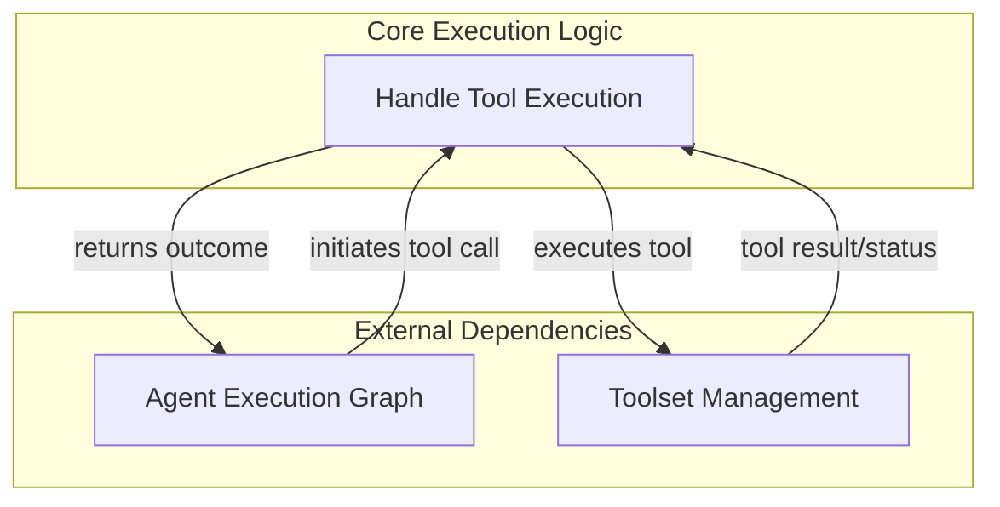

# Tool Execution Logic

The `tool_execution_logic` module is a crucial component within the AI agent's operational framework, responsible for orchestrating the execution of tools and processing their immediate outcomes. It acts as the bridge between the agent's decision-making process (which determines *when* to call a tool) and the actual invocation and handling of the tool's results, including scenarios like deferred calls or those requiring explicit approval.

This module ensures that tool calls are properly executed, their results are captured, and any special conditions (like retries or user approvals) are managed, thereby maintaining the agent's workflow integrity and responsiveness.

## Architecture Overview

The `tool_execution_logic` module operates as a core part of the [agent execution graph](agent_execution_graph.md). It receives tool call instructions and, in turn, interacts with the [toolset management](toolset_management.md) module to perform the actual tool execution. The results or status updates from these tool executions are then fed back into the agent's graph for further processing.

<!-- DIAGRAM_JSON
{
    "direction": "TD",
    "nodes": [
        {"id": "agent_execution_graph", "label": "Agent Execution Graph", "type": "external", "link": "agent_execution_graph.md"},
        {"id": "tool_execution_handlers", "label": "Tool Execution Handlers", "type": "module", "link": "tool_execution_handlers.md"},
        {"id": "toolset_management", "label": "Toolset Management", "type": "external", "link": "toolset_management.md"}
    ],
    "edges": [
        {"source": "agent_execution_graph", "target": "tool_execution_handlers", "label": "initiates tool call"},
        {"source": "tool_execution_handlers", "target": "toolset_management", "label": "executes tool"},
        {"source": "toolset_management", "target": "tool_execution_handlers", "label": "tool result/status"},
        {"source": "tool_execution_handlers", "target": "agent_execution_graph", "label": "returns outcome"}
    ],
    "groups": [
        {
            "id": "core_logic",
            "label": "Core Execution Logic",
            "role": "generative",
            "nodes": ["tool_execution_handlers"]
        },
        {
            "id": "dependencies",
            "label": "External Dependencies",
            "role": "analytical",
            "nodes": ["agent_execution_graph", "toolset_management"]
        }
    ]
}
-->

## Sub-modules

### [Tool Execution Handlers](tool_execution_handlers.md)
This sub-module contains the core logic for executing individual tool calls and managing their immediate responses, including error handling, retries, and deferred execution scenarios. It directly processes the results of tool invocations before they are integrated back into the agent's overall execution flow.