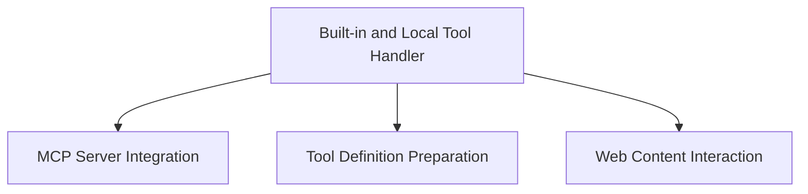

# Tool Integrations Module

The `tool_integrations` module provides a robust framework for integrating various tools within the Pydantic-AI agent system. It handles the complexities of using both native built-in model tools and custom local fallback tools, facilitating web interactions, MCP server communications, and dynamic tool definition management. This module is crucial for extending the capabilities of AI agents by allowing them to interact with external systems and data sources seamlessly.

## Architecture Overview

The `tool_integrations` module is structured around several key sub-modules, each responsible for a specific aspect of tool management and interaction. The `builtin_local_tool_handler` forms the base, providing the mechanism for discerning and utilizing either a model's native tool or a locally defined alternative. Other capabilities, such as `mcp_server_capability`, `tool_definition_preparation`, and `web_content_interaction`, build upon this foundation to offer specialized functionalities.

<!-- DIAGRAM_JSON
{
    "direction": "TD",
    "nodes": [
        {"id": "builtin_local_tool_handler", "label": "Built-in and Local Tool Handler", "type": "module", "link": "builtin_local_tool_handler.md"},
        {"id": "mcp_server_capability", "label": "MCP Server Integration", "type": "module", "link": "mcp_server_capability.md"},
        {"id": "tool_definition_preparation", "label": "Tool Definition Preparation", "type": "module", "link": "tool_definition_preparation.md"},
        {"id": "web_content_interaction", "label": "Web Content Interaction", "type": "module", "link": "web_content_interaction.md"}
    ],
    "edges": [
        {"source": "builtin_local_tool_handler", "target": "mcp_server_capability"},
        {"source": "builtin_local_tool_handler", "target": "tool_definition_preparation"},
        {"source": "builtin_local_tool_handler", "target": "web_content_interaction"}
    ],
    "groups": []
}
-->

## Sub-modules

### [Built-in and Local Tool Handler](builtin_local_tool_handler.md)
This sub-module provides the core logic for managing tools that can either be a native built-in feature of a model or a locally implemented fallback. It intelligently switches between these based on model capabilities and configuration.

### [MCP Server Integration](mcp_server_capability.md)
Facilitates communication with MCP (Multi-Capability Platform) servers. It supports both direct built-in MCP server connections and local HTTP connections when native support is unavailable, handling authorization, headers, and tool filtering.

### [Tool Definition Preparation](tool_definition_preparation.md)
This sub-module allows for the dynamic filtering and modification of tool definitions before they are presented to the agent. It wraps a `ToolsPrepareFunc` to enable custom logic for tool selection and alteration.

### [Web Content Interaction](web_content_interaction.md)
Offers comprehensive capabilities for interacting with web content, including fetching URLs and performing web searches. It leverages built-in model features for these tasks when available, and falls back to local implementations (like markdownify-based fetch or DuckDuckGo search) otherwise.
