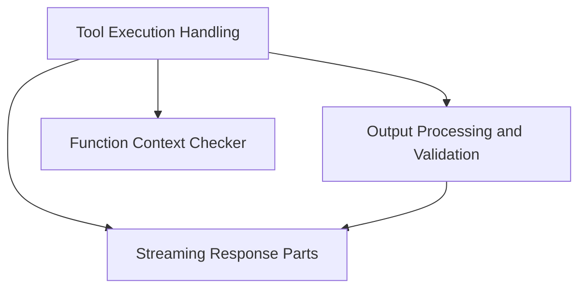

# `tool_output_management` Module Documentation

## Introduction

The `tool_output_management` module is responsible for orchestrating the execution of tools, defining and validating agent outputs, and managing the streaming of model responses within the `pydantic_ai_slim` framework. It provides core functionalities for agents to interact with tools, process their results, and structure their final responses.

## Architecture Overview

The `tool_output_management` module is composed of several key sub-modules that work in concert to handle tool interactions and output generation. The diagram below illustrates their relationships and dependencies.

<!-- DIAGRAM_JSON
{
    "direction": "TD",
    "nodes": [
        {"id": "tool_execution_handling", "label": "Tool Execution Handling", "type": "module", "link": "tool_execution_handling.md"},
        {"id": "output_processing_validation", "label": "Output Processing and Validation", "type": "module", "link": "output_processing_validation.md"},
        {"id": "streaming_response_parts", "label": "Streaming Response Parts", "type": "module", "link": "streaming_response_parts.md"},
        {"id": "function_context_checker", "label": "Function Context Checker", "type": "module", "link": "function_context_checker.md"}
    ],
    "edges": [
        {"source": "tool_execution_handling", "target": "function_context_checker"},
        {"source": "tool_execution_handling", "target": "output_processing_validation"},
        {"source": "tool_execution_handling", "target": "streaming_response_parts"},
        {"source": "output_processing_validation", "target": "streaming_response_parts"}
    ],
    "groups": []
}
-->

## Sub-modules

This module is further divided into the following sub-modules, each focusing on a specific aspect of tool and output management:

*   **[Tool Execution Handling](tool_execution_handling.md)**: Manages the lifecycle of tool calls, including validation, execution, retries, and parallel processing for agent run steps.
*   **[Output Processing and Validation](output_processing_validation.md)**: Defines how agent outputs are structured, processed, and validated, including support for various output types and deferred tool requests.
*   **[Streaming Response Parts](streaming_response_parts.md)**: Manages the collection and processing of streamed response parts from models, including text, thinking, and tool call deltas.
*   **[Function Context Checker](function_context_checker.md)**: Utility to determine if a callable function expects a `RunContext` as its first argument.