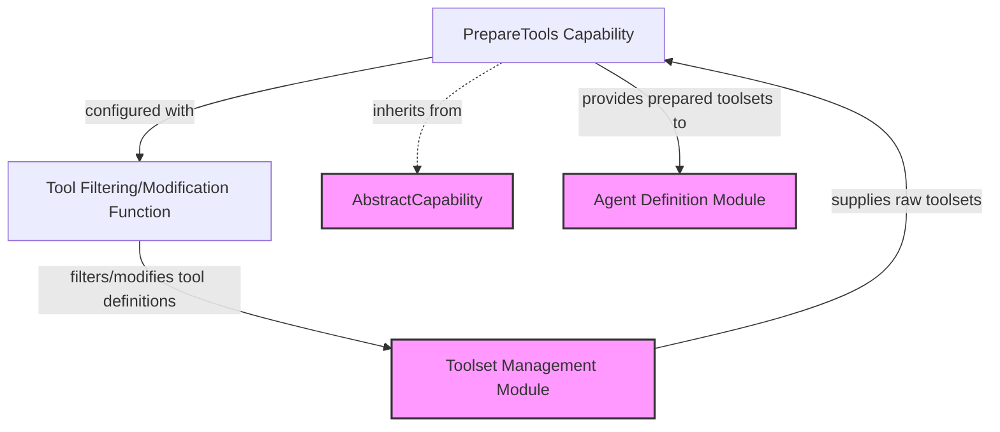

# Tool Preparation and Filtering Module (`tool_preparation_and_filtering`)

The `tool_preparation_and_filtering` module is a crucial component within the agent's capability system, responsible for dynamically adjusting the set of tools available to an AI agent. It allows developers to define custom logic for filtering, modifying, or enhancing tool definitions before they are presented to the agent. This ensures that agents operate with a curated and relevant set of tools, improving performance, security, and adherence to specific operational policies.

## Module Overview

This module centers around the `PrepareTools` capability, which acts as a flexible pipeline stage. By integrating `PrepareTools`, agents can adapt their tool usage based on context, user roles, or runtime conditions without altering the core tool definitions. This is particularly useful for implementing security policies (e.g., hiding administrative tools from certain users) or optimizing tool selection for specific tasks.

## Core Components

### `PrepareTools`

The `PrepareTools` class is an implementation of an [AbstractCapability](capabilities_base.md) that encapsulates a `ToolsPrepareFunc`. This function is a callable responsible for taking a list of raw tool definitions and returning a modified list.

*   **Dynamic Tool Management**: It enables dynamic modification of tool definitions at runtime.
*   **Integration**: Seamlessly integrates into the agent's capability chain, allowing for complex tool-handling workflows.
*   **Flexibility**: Supports any custom logic defined within the `ToolsPrepareFunc`, from simple filtering to sophisticated schema transformations.

**Example Usage:**

The example demonstrates how to use `PrepareTools` to hide tools prefixed with `admin_`, ensuring that an agent cannot access them. This capability would be part of the agent's initialization, influencing all subsequent tool interactions.

## How it Works

1.  **Capability Instantiation**: A `PrepareTools` instance is created, initialized with a `ToolsPrepareFunc` (a Python callable). This function defines the specific logic for tool preparation.
2.  **Toolset Wrapping**: When an agent needs to access its tools, `PrepareTools`'s `get_wrapper_toolset` method is invoked. This method receives an existing [AbstractToolset](toolset_management.md) from the agent.
3.  **Application of Logic**: `PrepareTools` then applies its configured `ToolsPrepareFunc` to the tool definitions provided by the `AbstractToolset`. The `ToolsPrepareFunc` returns a potentially modified list of tool definitions.
4.  **Wrapped Toolset**: A new, "wrapped" toolset (specifically, a `PreparedToolset` internally) is returned to the agent. This wrapped toolset presents the filtered or modified tool definitions to the agent, effectively controlling which tools are visible and how they appear.

This mechanism ensures that the original tool definitions remain untouched, while the agent interacts with a dynamically prepared view of the available tools.

## Relationship to Other Modules

*   **[Capabilities Base Module](capabilities_base.md)**: `PrepareTools` extends `AbstractCapability`, inheriting core capability behaviors and allowing it to be part of the agent's capability chain.
*   **[Toolset Management Module](toolset_management.md)**: This module defines `AbstractToolset` and `ToolDefinition`, which are the fundamental structures `PrepareTools` operates on. It also defines the `ToolsPrepareFunc` type.
*   **[Agent Definition Module](agent_definition.md)**: The `Agent` class in this module consumes the `PrepareTools` capability, incorporating it into the agent's overall operational logic to control its tool access.

<!-- DIAGRAM_JSON
{
    "direction": "TD",
    "nodes": [
        {"id": "prepare_tools", "label": "PrepareTools Capability", "type": "component", "link": null},
        {"id": "tools_prepare_func", "label": "Tool Filtering/Modification Function", "type": "component", "link": null},
        {"id": "abstract_capability", "label": "AbstractCapability", "type": "external", "link": "capabilities_base.md"},
        {"id": "toolset_management", "label": "Toolset Management Module", "type": "external", "link": "toolset_management.md"},
        {"id": "agent_definition", "label": "Agent Definition Module", "type": "external", "link": "agent_definition.md"}
    ],
    "edges": [
        {"source": "prepare_tools", "target": "abstract_capability", "label": "inherits from"},
        {"source": "prepare_tools", "target": "tools_prepare_func", "label": "configured with"},
        {"source": "tools_prepare_func", "target": "toolset_management", "label": "filters/modifies tool definitions"},
        {"source": "toolset_management", "target": "prepare_tools", "label": "supplies raw toolsets"},
        {"source": "prepare_tools", "target": "agent_definition", "label": "provides prepared toolsets to"}
    ],
    "groups": []
}
-->

