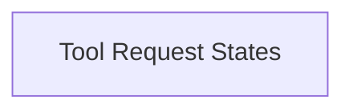

<!-- AUTO_GENERATED_PLACEHOLDER
  reason: LLM did not create .md file for this module
  module_path: pydantic_ai_agent_core/ui_vercel_ai_adapter/vercel_ai_request_types/static_tool_requests/tool_request_states
  component_count: 3
  generated_at: 2026-04-06T06:47:34.939372
  TODO: Fix LLM prompt to handle small leaf modules
-->

# Tool Request States

> ⚠️ **Auto-Generated Placeholder**
> This documentation was auto-generated because the LLM failed to create it.
> Module path: `pydantic_ai_agent_core/ui_vercel_ai_adapter/vercel_ai_request_types/static_tool_requests/tool_request_states`

Defines the different states a tool request can be in, including input streaming, approval requested, and approval responded, within the Vercel AI UI context.

## Components

This module contains 3 component(s):

- `pydantic_ai_slim.pydantic_ai.ui.vercel_ai.request_types.ToolInputStreamingPart`
- `pydantic_ai_slim.pydantic_ai.ui.vercel_ai.request_types.ToolApprovalRequestedPart`
- `pydantic_ai_slim.pydantic_ai.ui.vercel_ai.request_types.ToolApprovalRespondedPart`

## Structure

---
*Auto-generated placeholder. See sync_issues.json for details.*
