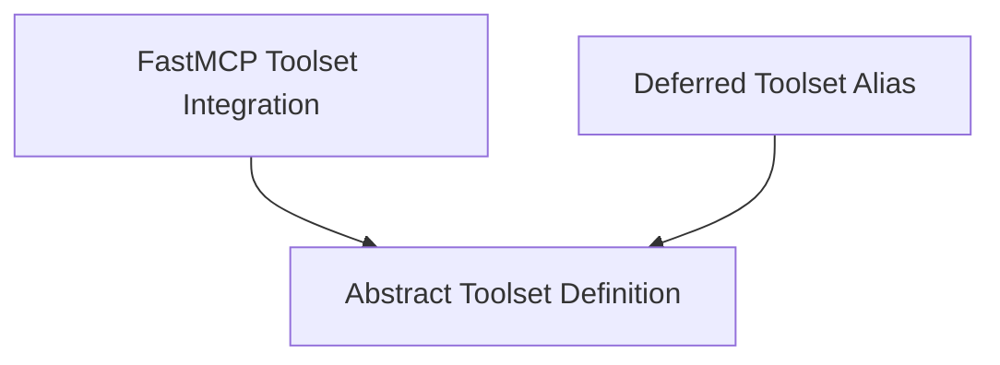

# Toolset Architecture

## Introduction and Purpose

The `toolset_architecture` module defines the foundational structure and implementations for managing collections of tools that agents can utilize. It establishes the abstract interface for all toolsets, provides specialized implementations like the FastMCP Toolset for remote tool execution, and includes mechanisms for modifying toolset behavior such as filtering, prefixing, and deferred loading. This module is critical for enabling agents to discover, validate, and execute various tools efficiently and securely.

## Architecture Overview

The `toolset_architecture` module is structured around an abstract base class that defines the common interface for all toolsets. Concrete implementations extend this base to provide specific functionalities, such as integrating with external services (FastMCP) or handling tool loading strategies. The module also provides decorators and utility functions to modify toolset behavior dynamically.

<!-- DIAGRAM_JSON
{
    "direction": "TD",
    "nodes": [
        {"id": "abstract_toolset", "label": "Abstract Toolset Definition", "type": "module", "link": "abstract_toolset.md"},
        {"id": "deferred_toolset", "label": "Deferred Toolset Alias", "type": "module", "link": "deferred_toolset.md"},
        {"id": "fastmcp_toolset", "label": "FastMCP Toolset Integration", "type": "module", "link": "fastmcp_toolset.md"}
    ],
    "edges": [
        {"source": "fastmcp_toolset", "target": "abstract_toolset"},
        {"source": "deferred_toolset", "target": "abstract_toolset"}
    ],
    "groups": []
}
-->

## High-Level Functionality of Sub-modules

### [Abstract Toolset Definition](abstract_toolset.md)

This sub-module defines `AbstractToolset`, an abstract base class that all toolsets must inherit from. It outlines the core contract for toolsets, including methods for retrieving tool definitions, calling tools, and managing the toolset's lifecycle (`__aenter__` and `__aexit__`). It also provides mechanisms for applying transformations to toolsets, such as filtering, prefixing, renaming, and deferred loading of tools.

### [Deferred Toolset Alias](deferred_toolset.md)

The `DeferredToolset` component serves as a deprecated alias for `ExternalToolset`. Its primary function is to indicate tools that should be loaded lazily, becoming available only when explicitly discovered through a tool search mechanism. This allows for optimization by not loading all tools upfront, especially for large or less frequently used toolsets.

### [FastMCP Toolset Integration](fastmcp_toolset.md)

The `FastMCPToolset` provides an implementation for interacting with FastMCP (Multi-Capability Protocol) servers. It enables agents to call tools exposed by local or remote FastMCP services. This toolset handles the client-server communication, including initialization, tool listing, and tool invocation. It also incorporates error handling mechanisms, allowing for model retries or immediate error propagation upon tool failure. It can optionally include server-provided instructions to guide agent behavior.
