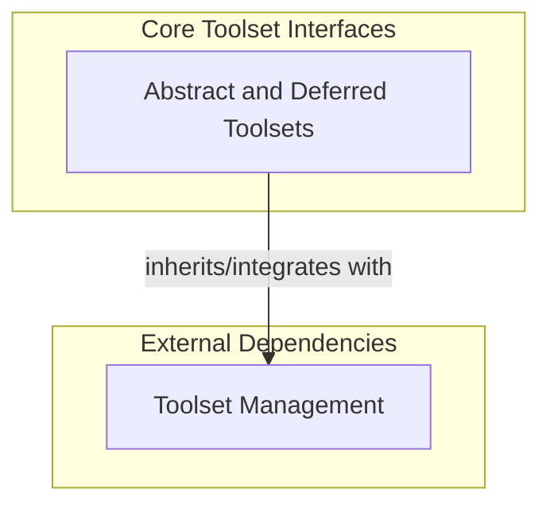

# Toolset Interfaces Module

## Introduction

The `toolset_interfaces` module defines the foundational interfaces and base classes for managing collections of tools within the Pydantic AI agent framework. It provides the essential structure for agents to discover, validate, and execute various tools, enabling flexible and extensible interaction with external capabilities and internal functionalities.

This module is critical for establishing a standardized way to integrate different toolsets, whether they are built-in utilities, external services, or specialized functionalities, ensuring seamless operation across the agent's ecosystem.

## Architecture Overview

The `toolset_interfaces` module primarily revolves around the `AbstractToolset`, which acts as the blueprint for all concrete toolset implementations. It provides core methods for tool discovery (`get_tools`), execution (`call_tool`), and lifecycle management (`__aenter__`, `__aexit__`). The module also includes `DeferredToolset` which is a deprecated alias for `ExternalToolset` (defined in [toolset_management.md](toolset_management.md)), facilitating the integration of tools that may not be immediately available or need dynamic loading.

These interfaces ensure that the Pydantic AI agent can interact with any compliant toolset in a consistent manner, promoting modularity and extensibility.

<!-- DIAGRAM_JSON
{
    "direction": "TD",
    "nodes": [
        {"id": "abstract_and_deferred_toolsets", "label": "Abstract and Deferred Toolsets", "type": "module", "link": "abstract_and_deferred_toolsets.md"},
        {"id": "toolset_management", "label": "Toolset Management", "type": "external", "link": "toolset_management.md"}
    ],
    "edges": [
        {"source": "abstract_and_deferred_toolsets", "target": "toolset_management", "label": "inherits/integrates with"}
    ],
    "groups": [
        {
            "id": "core_interfaces",
            "label": "Core Interfaces",
            "role": "generative",
            "nodes": ["abstract_and_deferred_toolsets"]
        },
        {
            "id": "dependencies",
            "label": "Dependencies",
            "role": "data",
            "nodes": ["toolset_management"]
        }
    ]
}
-->

## Sub-modules

- [Abstract and Deferred Toolsets](abstract_and_deferred_toolsets.md): This sub-module defines the fundamental interfaces and classes for creating and managing toolsets, including the base `AbstractToolset` and the `DeferredToolset` for handling external tool loading.