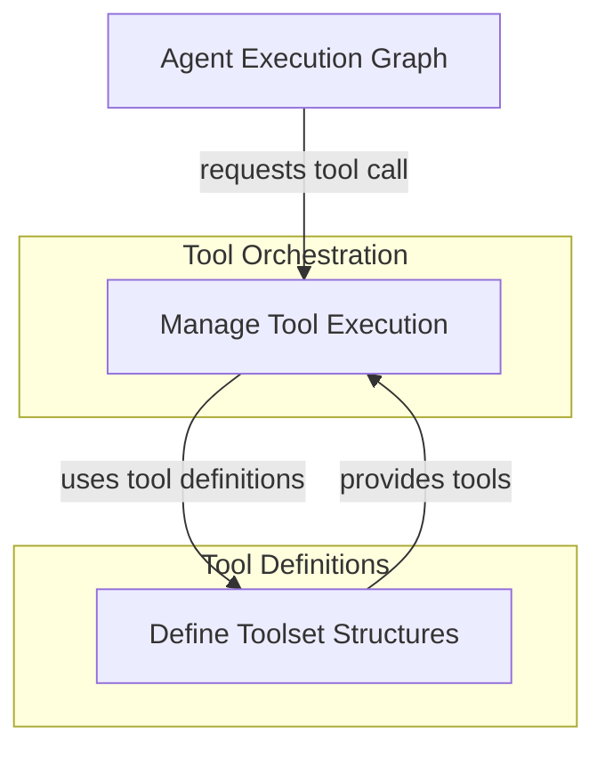

# Toolset Management Module

The `toolset_management` module is a crucial component within the `pydantic_ai_agent_core` framework, responsible for the effective organization, validation, and execution of tools used by AI agents. It provides the foundational structures for defining toolsets, managing individual tools within those sets, and orchestrating their interaction with the agent's execution environment. This module ensures that agents can reliably discover, prepare, and invoke external capabilities or internal functions to achieve their goals.

## Architecture Overview

The `toolset_management` module is composed of two primary sub-modules: the `tool_manager_logic` which handles the dynamic aspects of tool interaction during an agent run, and `toolset_interfaces` which provides the abstract definitions and base classes for creating various types of toolsets. These components work in tandem to provide a flexible and robust system for integrating tools into AI agents.

<!-- DIAGRAM_JSON
{
    "direction": "TD",
    "nodes": [
        {
            "id": "toolset_management",
            "label": "Toolset Management",
            "type": "module"
        },
        {
            "id": "tool_manager_logic",
            "label": "Manage Tool Execution",
            "type": "module",
            "link": "tool_manager_logic.md"
        },
        {
            "id": "toolset_interfaces",
            "label": "Define Toolset Structures",
            "type": "module",
            "link": "toolset_interfaces.md"
        },
        {
            "id": "agent_execution_graph",
            "label": "Agent Execution Graph",
            "type": "external",
            "link": "agent_execution_graph.md"
        }
    ],
    "edges": [
        {
            "source": "agent_execution_graph",
            "target": "tool_manager_logic",
            "label": "requests tool call"
        },
        {
            "source": "tool_manager_logic",
            "target": "toolset_interfaces",
            "label": "uses tool definitions"
        },
        {
            "source": "toolset_interfaces",
            "target": "tool_manager_logic",
            "label": "provides tools"
        }
    ],
    "groups": [
        {
            "id": "tool_orchestration",
            "label": "Tool Orchestration",
            "role": "generative",
            "nodes": [
                "tool_manager_logic"
            ]
        },
        {
            "id": "tool_definitions",
            "label": "Tool Definitions",
            "role": "data",
            "nodes": [
                "toolset_interfaces"
            ]
        }
    ]
}
-->

## Sub-modules

This module consists of the following key sub-modules:

### [Tool Manager Logic](tool_manager_logic.md)
This sub-module, primarily driven by the `ToolManager` component, is responsible for the core logic of handling tool calls during an agent's execution. It manages caching tool definitions, validating tool arguments, executing tools, and implementing retry mechanisms for failed tool invocations. It also supports different parallel execution modes for tool calls.

### [Toolset Interfaces and Types](toolset_interfaces.md)
This sub-module defines the abstract `AbstractToolset` which serves as the fundamental contract for all toolsets within the framework. It specifies how toolsets list their tools, validate arguments, and handle tool calls. It also includes `DeferredToolset`, an external toolset type. This sub-module is critical for enabling extensible and standardized tool integration.
