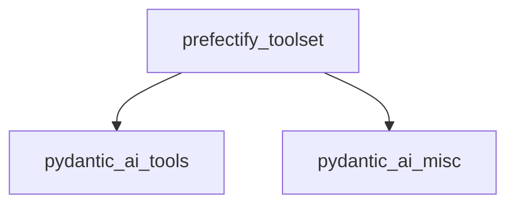

# `toolset_prefectification`

The `toolset_prefectification` module is a crucial part of the durable execution framework, specifically designed to integrate Pydantic-AI toolsets with Prefect workflows. Its primary role is to wrap existing toolsets, enabling their functions to be executed as Prefect tasks, thereby benefiting from Prefect's orchestration, monitoring, and caching capabilities.

## Architecture and Component Relationships

This module resides within the `prefect_integration` module, which is responsible for enabling durable execution of AI agents using Prefect. The core functionality provided here is the `prefectify_toolset` function, which acts as an adapter, transforming standard Pydantic-AI toolsets into Prefect-compatible versions.

The module depends on the core `pydantic_ai_tools` for abstract toolset definitions and specific toolset implementations like `FunctionToolset`. It also interacts with `pydantic_ai_misc` to handle `MCPServer` instances for Multi-Agent Communication Protocol.

<!-- DIAGRAM_JSON
{
    "direction": "TD",
    "nodes": [
        {"id": "prefectify_toolset_func", "label": "prefectify_toolset", "type": "component", "link": null},
        {"id": "pydantic_ai_tools", "label": "pydantic_ai_tools", "type": "external", "link": "pydantic_ai_tools.md"},
        {"id": "pydantic_ai_misc", "label": "pydantic_ai_misc", "type": "external", "link": "pydantic_ai_misc.md"}
    ],
    "edges": [
        {"source": "prefectify_toolset_func", "target": "pydantic_ai_tools"},
        {"source": "prefectify_toolset_func", "target": "pydantic_ai_misc"}
    ],
    "groups": []
}
-->


## Core Functionality

### `prefectify_toolset`

```python
def prefectify_toolset(
    toolset: AbstractToolset[AgentDepsT],
    mcp_task_config: TaskConfig,
    tool_task_config: TaskConfig,
    tool_task_config_by_name: dict[str, TaskConfig | None],
) -> AbstractToolset[AgentDepsT]:
    """Wrap a toolset to integrate it with Prefect.

    Args:
        toolset: The toolset to wrap.
        mcp_task_config: The Prefect task config to use for MCP server tasks.
        tool_task_config: The default Prefect task config to use for tool calls.
        tool_task_config_by_name: Per-tool task configuration. Keys are tool names, values are TaskConfig or None.
    """
    # ... (implementation details)
```

The `prefectify_toolset` function is the main entry point for Prefect integration. It takes an `AbstractToolset` instance and various Prefect `TaskConfig` objects, then returns a Prefect-wrapped version of the toolset.

-   **`toolset`**: The original toolset to be adapted. This can be a `FunctionToolset` or an `MCPServer` instance.
-   **`mcp_task_config`**: Specifies the Prefect task configuration for tasks related to Multi-Agent Communication Protocol (MCP) servers.
-   **`tool_task_config`**: Defines the default Prefect task configuration for individual tool calls within the toolset.
-   **`tool_task_config_by_name`**: Allows for granular, per-tool Prefect task configuration, overriding the default `tool_task_config` for specific tools.

This function dynamically wraps the provided toolset based on its type:
- If the `toolset` is a `FunctionToolset`, it's wrapped with `PrefectFunctionToolset`.
- If the `toolset` is an `MCPServer`, it's wrapped with `PrefectMCPServer`.

If the toolset type is not explicitly handled, it is returned as is, meaning it won't be prefectified.

## How the Module Fits into the Overall System

The `toolset_prefectification` module plays a vital role in enabling the Pydantic-AI durable execution capabilities with Prefect. By prefectifying toolsets, it allows AI agent operations, especially tool calls, to be managed and orchestrated by Prefect. This ensures that tool executions are reliable, observable, and can benefit from Prefect's features like retries, caching, and scheduling, which are essential for robust AI workflows. This module bridges the gap between Pydantic-AI's agent tool usage and Prefect's workflow management system, making the AI agents more resilient and production-ready.
