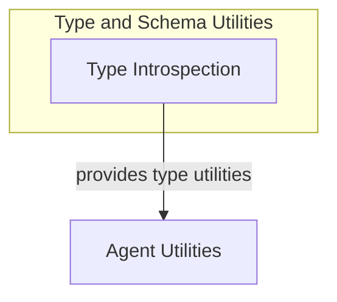

# Type and Schema Utilities

The `type_and_schema_utilities` module provides essential tools for introspecting Python types and function schemas within the pydantic_ai_slim framework. It plays a crucial role in dynamic schema validation, function argument analysis, and flexible type handling, particularly for `Union` types and context-aware callables.

## Architecture

This module is designed to offer foundational utilities that support more complex operations in areas like agent definition, output handling, and general utility functions.

<!-- DIAGRAM_JSON
{
    "direction": "TD",
    "nodes": [
        {"id": "type_introspection", "label": "Type Introspection", "type": "module", "link": "type_introspection.md"},
        {"id": "agent_utilities", "label": "Agent Utilities", "type": "external", "link": "agent_utilities.md"}
    ],
    "edges": [
        {"source": "type_introspection", "target": "agent_utilities", "label": "provides type utilities"}
    ],
    "groups": [
        {
            "id": "type_and_schema_utilities_group",
            "label": "Type and Schema Utilities",
            "role": "analytical",
            "nodes": ["type_introspection"]
        }
    ]
}
-->

## Sub-modules

### [Type Introspection](type_introspection.md)
This sub-module provides utilities for inspecting function signatures and extracting type information from Union types for schema validation and processing.
