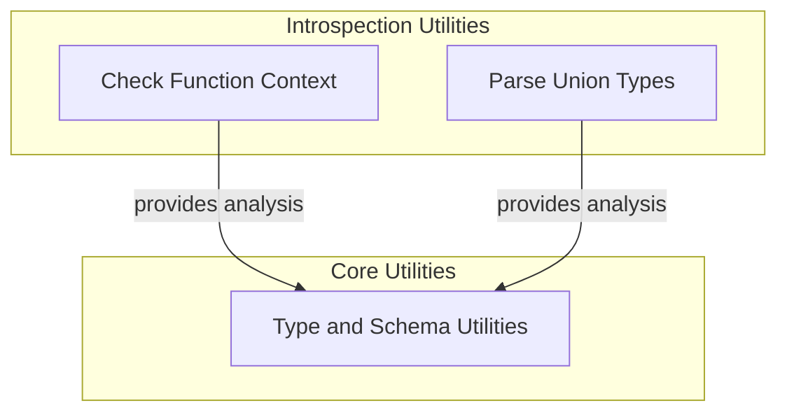

# Type Introspection Module

The `type_introspection` module provides essential utilities for examining and understanding Python types and function signatures at runtime. This capability is fundamental for dynamically building agent graphs, validating inputs, and adapting to various callable interfaces within the `pydantic_ai_agent_core` framework. It allows the system to intelligently interpret how functions should be called and how types are structured, especially concerning complex `Union` types and context-aware function arguments.

## Architecture Overview

This module integrates closely with the `type_and_schema_utilities` module, providing foundational type analysis capabilities that inform how agents and tools process data and execute. It primarily consists of two core components:

1.  **Function Context Checker**: Identifies if a callable requires a `RunContext`.
2.  **Union Type Argument Extractor**: Parses arguments from `Union` types for detailed inspection.

<!-- DIAGRAM_JSON
{
    "direction": "TD",
    "nodes": [
        {
            "id": "type_introspection",
            "label": "Type Introspection",
            "type": "module"
        },
        {
            "id": "function_context_checker",
            "label": "Check Function Context",
            "type": "module",
            "link": "function_context_checker.md"
        },
        {
            "id": "union_type_parser",
            "label": "Parse Union Types",
            "type": "module",
            "link": "union_type_parser.md"
        },
        {
            "id": "type_and_schema_utilities",
            "label": "Type and Schema Utilities",
            "type": "external",
            "link": "type_and_schema_utilities.md"
        }
    ],
    "edges": [
        {
            "source": "function_context_checker",
            "target": "type_and_schema_utilities",
            "label": "provides analysis"
        },
        {
            "source": "union_type_parser",
            "target": "type_and_schema_utilities",
            "label": "provides analysis"
        }
    ],
    "groups": [
        {
            "id": "introspection_utilities",
            "label": "Introspection Utilities",
            "role": "analytical",
            "nodes": [
                "function_context_checker",
                "union_type_parser"
            ]
        },
        {
            "id": "core_utilities",
            "label": "Core Utilities",
            "role": "generative",
            "nodes": [
                "type_and_schema_utilities"
            ]
        }
    ]
}
-->

## Sub-modules

### [Function Context Checker](function_context_checker.md)

This sub-module is responsible for determining whether a given callable (function or method) is designed to accept a `RunContext` object as its first argument. This is vital for functions that need access to runtime execution context, such as logging, state management, or resource handling. It ensures that context-aware functions are correctly identified and invoked.

### [Union Type Argument Extractor](union_type_parser.md)

The `Union Type Argument Extractor` sub-module focuses on the intricate task of dissecting Python `Union` types. It can extract and unwrap the individual types that compose a `Union`, even when nested within `Annotated` types. This capability is essential for schema validation, dynamic argument parsing, and ensuring type compatibility in scenarios where flexible type definitions are used.