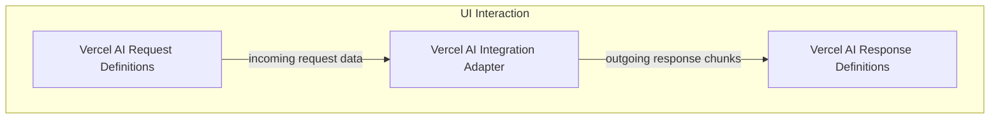

# ui_vercel_ai_adapter Module Documentation

## Introduction and Purpose
The `ui_vercel_ai_adapter` module provides a robust and flexible integration layer between Pydantic AI agents and the Vercel AI SDK. It enables Pydantic AI agents to communicate seamlessly with Vercel AI frontends by handling the transformation of messages and tool calls between the two systems. This module is crucial for deploying Pydantic AI-powered applications that leverage the Vercel AI SDK for rich, interactive user interfaces, especially those requiring human-in-the-loop tool approval workflows.

## Architecture Overview
The module is structured into three main components: the core adapter, and distinct definitions for Vercel AI request and response types. The `VercelAIAdapter` acts as the central orchestrator, translating incoming Vercel AI requests into Pydantic AI messages and Pydantic AI responses back into Vercel AI-compatible chunks for streaming to the frontend.

<!-- DIAGRAM_JSON
{
    "direction": "TD",
    "nodes": [
        {
            "id": "ui_vercel_ai_adapter",
            "label": "ui_vercel_ai_adapter",
            "type": "module"
        },
        {
            "id": "vercel_ai_integration_adapter",
            "label": "Vercel AI Integration Adapter",
            "type": "module",
            "link": "vercel_ai_integration_adapter.md"
        },
        {
            "id": "vercel_ai_request_types",
            "label": "Vercel AI Request Definitions",
            "type": "module",
            "link": "vercel_ai_request_types.md"
        },
        {
            "id": "vercel_ai_response_types",
            "label": "Vercel AI Response Definitions",
            "type": "module",
            "link": "vercel_ai_response_types.md"
        }
    ],
    "edges": [
        {
            "source": "vercel_ai_request_types",
            "target": "vercel_ai_integration_adapter",
            "label": "incoming request data"
        },
        {
            "source": "vercel_ai_integration_adapter",
            "target": "vercel_ai_response_types",
            "label": "outgoing response chunks"
        }
    ],
    "groups": [
        {
            "id": "ui_interaction",
            "label": "UI Interaction",
            "role": "surface",
            "nodes": [
                "vercel_ai_integration_adapter",
                "vercel_ai_request_types",
                "vercel_ai_response_types"
            ]
        }
    ]
}
-->

## High-level functionality of each sub-module:

*   **[Vercel AI Integration Adapter](vercel_ai_integration_adapter.md)**: This sub-module contains the primary `VercelAIAdapter` class, which is responsible for building run inputs from Vercel AI requests, dispatching requests to Pydantic AI agents, and constructing event streams for the Vercel AI frontend. It manages the complex process of converting messages and handling tool approval flows, particularly for SDK versions that support human-in-the-loop interactions.

*   **[Vercel AI Request Definitions](vercel_ai_request_types.md)**: This sub-module defines the data models for various types of messages and tool-related events that originate from the Vercel AI frontend. These definitions ensure that incoming data is correctly parsed and understood by the `VercelAIAdapter`, facilitating structured communication from the UI to the agent.

*   **[Vercel AI Response Definitions](vercel_ai_response_types.md)**: This sub-module outlines the data structures for the different types of chunks that the `VercelAIAdapter` sends back to the Vercel AI frontend. These response types enable streaming of text, tool outputs, source documents, and other metadata, providing a dynamic and responsive user experience.
