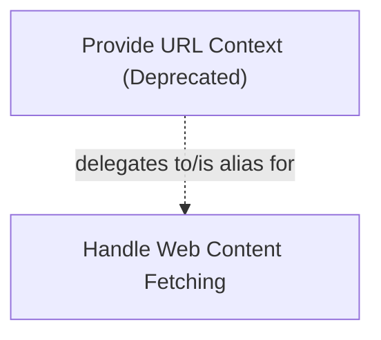

# url_context_tool

The `url_context_tool` module provides a backward-compatible alias for the `WebFetchTool`. Its primary purpose is to allow existing systems and serialized payloads that reference `"kind": "url_context"` to continue functioning correctly by mapping these requests to the underlying web fetching capabilities. While it serves as a bridge for legacy implementations, new developments should directly utilize the `WebFetchTool` or the broader web fetching capabilities provided by the system.

## Module Overview

This module is a leaf module within the `data_retrieval_tools` family, specifically focusing on providing a compatibility layer for web content retrieval. It ensures that agents can still access and process information from URLs even if their configuration or historical data refers to the older `url_context` kind.

From a user's perspective, employing the `UrlContextTool` essentially triggers the same web content fetching mechanism as the more modern `WebFetchTool`. The module abstracts away the underlying change, offering a consistent interface for web interaction.

## Architecture

The `url_context_tool` module functions as a thin wrapper or alias. Its core component, `UrlContextTool`, inherits from and delegates to the `WebFetchTool`, which is part of the system's web interaction capabilities. This design ensures that the actual logic for fetching and processing web content resides in a dedicated, more robust module, while `url_context_tool` handles compatibility.

<!-- DIAGRAM_JSON
{
    "direction": "TD",
    "nodes": [
        {
            "id": "url_context_tool_alias",
            "label": "Provide URL Context (Deprecated)",
            "type": "component",
            "link": null
        },
        {
            "id": "web_fetch_capability",
            "label": "Handle Web Content Fetching",
            "type": "external",
            "link": "capabilities_web_interaction.md"
        }
    ],
    "edges": [
        {
            "source": "url_context_tool_alias",
            "target": "web_fetch_capability",
            "label": "delegates to/is alias for"
        }
    ],
    "groups": []
}
-->

## Related Modules

*   **[data_retrieval_tools.md](data_retrieval_tools.md)**: The parent module that groups tools for retrieving various types of data, including web content and file system information.
*   **[capabilities_web_interaction.md](capabilities_web_interaction.md)**: This module contains the `WebFetch` capability, which is where the core logic for fetching and processing web content (via `WebFetchTool`) is implemented. The `url_context_tool` relies on this module for its actual functionality.