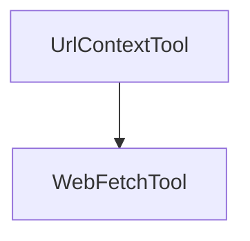

# url_context_tool

## Introduction
The `url_context_tool` module provides the `UrlContextTool` class, which serves as a deprecated alias for the `WebFetchTool`. Its primary purpose is to ensure backward compatibility for deserializing older serialized payloads that refer to a tool of `kind: "url_context"`. Developers should use `WebFetchTool` directly for new implementations.

## Architecture and Component Relationships

The `UrlContextTool` is a specialized built-in tool that inherits from `WebFetchTool`. This inheritance allows it to leverage the functionality of `WebFetchTool` while maintaining a distinct `kind` attribute for backward compatibility.

<!-- DIAGRAM_JSON
{
    "direction": "TD",
    "nodes": [
        {"id": "url_context_tool", "label": "UrlContextTool", "type": "component", "link": null},
        {"id": "web_fetch_tool", "label": "WebFetchTool", "type": "external", "link": "pydantic_ai_capabilities.md"}
    ],
    "edges": [
        {"source": "url_context_tool", "target": "web_fetch_tool"}
    ],
    "groups": []
}
-->



## Core Functionality

### `UrlContextTool`
The `UrlContextTool` class is defined as follows:

```python
class UrlContextTool(WebFetchTool):
    """Deprecated alias for WebFetchTool. Use WebFetchTool instead.

    Overrides kind to 'url_context' so old serialized payloads with {"kind": "url_context", ...}
    can be deserialized to UrlContextTool for backward compatibility.
    """

    kind: str = 'url_context'
    """The kind of tool (deprecated value for backward compatibility)."""
```

*   **Purpose**: Acts as a direct alias for `WebFetchTool`. It is explicitly designed for backward compatibility, allowing systems to correctly interpret and load tool configurations that specify `kind: 'url_context'`.
*   **Inheritance**: It inherits all capabilities from `WebFetchTool`, meaning it can perform web fetching operations.
*   **`kind` attribute**: The `kind` attribute is overridden to `'url_context'`. This is crucial for deserialization processes, ensuring that older data structures are correctly mapped to this tool.

## Relationship to Other Modules

The `url_context_tool` module is part of the `builtin_tools` sub-module within the larger `pydantic_ai_tools` module. It depends on the `WebFetchTool`, which is functionally related to the `web_fetch` capability found in the `pydantic_ai_capabilities` module.

*   **pydantic_ai_tools**: This module contains various built-in tools available in the system, including `UrlContextTool`.
*   **pydantic_ai_capabilities**: The `WebFetchTool` functionality is ultimately derived from or closely related to the web fetching capabilities defined within `pydantic_ai_capabilities`. New implementations should directly utilize the modern `WebFetchTool` or the underlying `WebFetch` capability.