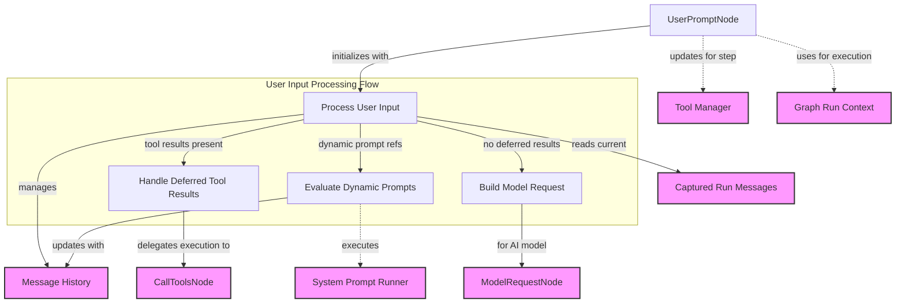

# User Prompt Node Module

## Introduction

The `user_prompt_node` module introduces the `UserPromptNode` class, a critical component within the agent's execution graph responsible for managing user interactions, instructions, and system prompts. It acts as the entry point for user input into the agent's workflow, orchestrating the initial setup of the conversation history and determining the next step in the agent's reasoning process, whether it involves generating a model request or executing deferred tool calls.

This module ensures that user prompts and system-level instructions are correctly incorporated into the agent's context, supporting both new conversations and the resumption of existing ones with dynamic adjustments based on the current state.

## Role and Purpose

`UserPromptNode` plays a pivotal role in the agent execution flow by:

1.  **Processing User Input**: It receives and integrates the user's prompt, converting it into a structured format for the agent.
2.  **Managing Conversation History**: It initializes and updates the message history, ensuring continuity across turns and proper handling of previous model responses and tool calls.
3.  **Handling Deferred Tool Results**: When an agent has previously requested tool calls and their results are available, this node processes these results before proceeding.
4.  **Applying System Prompts and Instructions**: It incorporates static and dynamically generated system prompts and instructions, setting the context and guardrails for the model's behavior.
5.  **Directing Flow**: Based on the input and conversation state, it decides whether the next action is a model request or further tool execution.

## Architecture Diagram

<!-- DIAGRAM_JSON
{
    "direction": "TD",
    "nodes": [
        {"id": "user_prompt_node_component", "label": "UserPromptNode", "type": "component", "link": null},
        {"id": "process_user_input", "label": "Process User Input", "type": "component", "link": null},
        {"id": "handle_deferred_results", "label": "Handle Deferred Tool Results", "type": "component", "link": null},
        {"id": "evaluate_dynamic_prompts", "label": "Evaluate Dynamic Prompts", "type": "component", "link": null},
        {"id": "build_model_request", "label": "Build Model Request", "type": "component", "link": null},
        {"id": "message_history", "label": "Message History", "type": "external", "link": "agent_output_handling.md"},
        {"id": "tool_manager", "label": "Tool Manager", "type": "external", "link": "toolset_management.md"},
        {"id": "system_prompt_runner", "label": "System Prompt Runner", "type": "external", "link": "capabilities_base.md"},
        {"id": "model_request_node", "label": "ModelRequestNode", "type": "external", "link": "model_request_node.md"},
        {"id": "call_tools_node", "label": "CallToolsNode", "type": "external", "link": "tool_execution_logic.md"},
        {"id": "run_context", "label": "Graph Run Context", "type": "external", "link": "graph_core_execution.md"},
        {"id": "captured_messages", "label": "Captured Run Messages", "type": "external", "link": "message_capture_utility.md"}
    ],
    "edges": [
        {"source": "user_prompt_node_component", "target": "process_user_input", "label": "initializes with"},
        {"source": "process_user_input", "target": "captured_messages", "label": "reads current"},
        {"source": "process_user_input", "target": "message_history", "label": "manages"},
        {"source": "process_user_input", "target": "handle_deferred_results", "label": "tool results present"},
        {"source": "handle_deferred_results", "target": "call_tools_node", "label": "delegates execution to"},
        {"source": "process_user_input", "target": "evaluate_dynamic_prompts", "label": "dynamic prompt refs"},
        {"source": "evaluate_dynamic_prompts", "target": "system_prompt_runner", "label": "executes"},
        {"source": "evaluate_dynamic_prompts", "target": "message_history", "label": "updates with"},
        {"source": "process_user_input", "target": "build_model_request", "label": "no deferred results"},
        {"source": "build_model_request", "target": "model_request_node", "label": "for AI model"},
        {"source": "user_prompt_node_component", "target": "tool_manager", "label": "updates for step"},
        {"source": "user_prompt_node_component", "target": "run_context", "label": "uses for execution"}
    ],
    "groups": [
        {
            "id": "user_input_processing",
            "label": "User Input Processing Flow",
            "role": "analytical", 
            "nodes": ["process_user_input", "evaluate_dynamic_prompts", "build_model_request", "handle_deferred_results"]
        }
    ]
}
-->

## Core Components

### `UserPromptNode`

`UserPromptNode` is a specialized `AgentNode` designed to manage the initial and ongoing user interaction within an agent's graph execution. It encapsulates the logic for processing user prompts, integrating system-level instructions, and handling the results of previously deferred tool calls.

**Key responsibilities of `UserPromptNode`:**

*   **`user_prompt`**: Stores the direct input from the user, which can be a simple string or a sequence of rich content parts.
*   **`instructions` and `instructions_functions`**: Defines static and dynamic instructions that guide the agent's behavior. These are applied alongside user prompts to shape the model's responses.
*   **`system_prompts`, `system_prompt_functions`, `system_prompt_dynamic_functions`**: Manages static and dynamic system prompts that set the foundational context for the agent. Dynamic system prompts are re-evaluated based on the current `RunContext`.
*   **`deferred_tool_results`**: Holds results from tool calls that were initiated in a previous step and need to be processed now. This is crucial for resuming conversational flows where human approval or external processing was required.

### How it Works

1.  **Message History Initialization**: Upon activation, the `run` method of `UserPromptNode` first retrieves any existing captured run messages and uses them to initialize or update the agent's `message_history`. This ensures that the agent always has the full context of the conversation.
2.  **Handling Deferred Tool Results**: If `deferred_tool_results` are present, the node prioritizes their processing. It constructs `ToolReturn` messages based on the approvals and call results, then transitions the execution directly to a [CallToolsNode](tool_execution_logic.md) to integrate these results into the conversation without requiring a new model request.
3.  **Resuming Without Prompt**: If no `user_prompt` is provided but the last message in history was a `ModelRequest`, the `UserPromptNode` can intelligently resume the conversation. It reuses parts of the previous `ModelRequest` and extracts any `UserPromptPart` content to update `ctx.deps.prompt`.
4.  **Dynamic Prompt Re-evaluation**: Before generating a new model request, the node re-evaluates any dynamic system prompts and instructions. This ensures that the agent's guiding context is always up-to-date with the current `RunContext`.
5.  **Building the Model Request**: If no deferred tool results are being processed, and after incorporating all system prompts and user input, the `UserPromptNode` constructs a new [ModelRequestNode](model_request_node.md). This request, containing the full conversation context and instructions, is then passed to the AI model for a response.

## Connections to Other Modules

*   **[Agent Output Handling](agent_output_handling.md)**: The `UserPromptNode` directly interacts with message history management, including `_messages.ModelMessage`, `_messages.ModelRequest`, `_messages.ModelResponse`, and various `_messages.ModelRequestPart` types for constructing and parsing conversation turns.
*   **[Tool Execution Logic](tool_execution_logic.md)**: When `deferred_tool_results` are provided, `UserPromptNode` hands off control to a `CallToolsNode` (from the `tool_execution_logic` module) to process and integrate these results into the agent's state.
*   **[Model Request Node](model_request_node.md)**: The primary output of `UserPromptNode` (when not handling deferred tool results) is to create and pass a `ModelRequestNode` to the next stage of the agent's graph, which is responsible for interacting with the AI model.
*   **[Message Capture Utility](message_capture_utility.md)**: It uses `get_captured_run_messages()` to retrieve messages that might have been captured during previous execution steps, ensuring the agent has access to a complete message stream.
*   **[Toolset Management](toolset_management.md)**: The node interacts with the `ToolManager` to get the correct toolset for the current run step, particularly when resolving dynamic tool calls or preparing for a new model request.
*   **[Graph Core Execution](graph_core_execution.md)**: It utilizes `GraphRunContext` and related context objects to maintain the state and dependencies throughout the agent's execution graph.
*   **[Capabilities Base](capabilities_base.md)**: The system prompt runners (`_system_prompt.SystemPromptRunner`) are conceptually related to capabilities, as they often involve dynamic logic and context generation that might be tied to an agent's defined capabilities. The `_function_schema._takes_ctx` utility from `agent_utilities` is also used for function schema processing which underpins these runners.